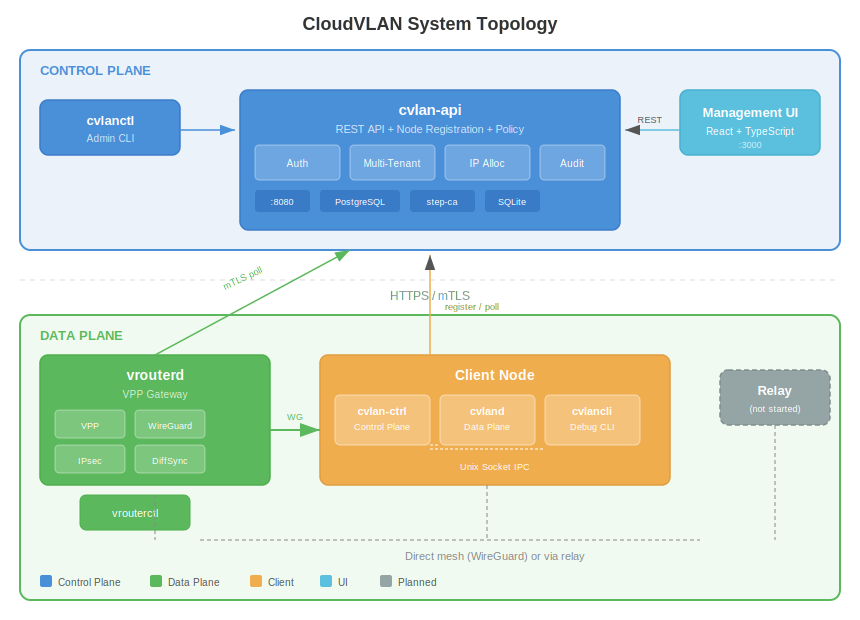
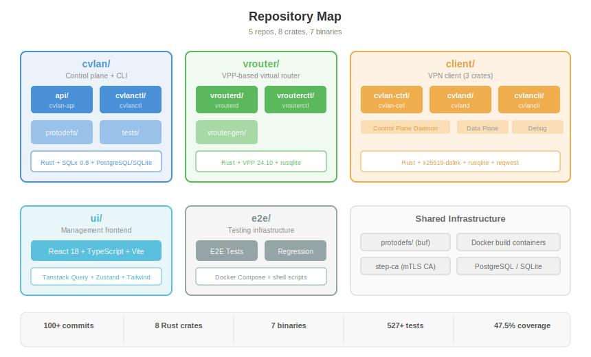

# CloudVLAN Documentation

> Next-generation overlay network: Tailscale simplicity + IPsec compliance + first-class self-hosting



## What is CloudVLAN?

CloudVLAN is an overlay network platform for enterprises that need secure, compliant network connectivity. It combines WireGuard for simplicity with IKEv2/IPsec for compliance, supports air-gapped deployments, and runs managed cloud vRouters as IPsec concentrators.

**Target**: 100k clients at < $2k/month infrastructure cost (~$0.02/client).

## Components

| Component | Binary | Repo | Description |
|-----------|--------|------|-------------|
| **cvlan-api** | cvlan-api | cvlan/ | REST API, node registration, policy, multi-tenant RBAC |
| **cvlanctl** | cvlanctl | cvlan/ | Admin CLI for tenant/CVLAN/node management |
| **vrouterd** | vrouterd | vrouter/ | VPP-based gateway with IPsec + WireGuard |
| **vrouterctl** | vrouterctl | vrouter/ | Gateway debug CLI |
| **cvlan-ctrl** | cvlan-ctrl | client/ | Client control plane daemon (discovery, registration, poll) |
| **cvland** | cvland | client/ | Client data plane daemon (WireGuard tunnels, future) |
| **cvlancli** | cvlancli | client/ | Client debug CLI |
| **Management UI** | — | ui/ | React 18 + TypeScript frontend |



## Documentation

### Architecture
- [System Overview](architecture/system-overview.md) — Big picture: control plane, data plane, how they connect
- [Control Plane API](architecture/control-plane-api.md) — cvlan-api deep dive: multi-tenancy, RBAC, scheduling
- [VRouter](architecture/vrouter.md) — VPP gateway: registration, DiffSync, IPsec
- [Client](architecture/client.md) — Three-crate architecture: cvlan-ctrl, cvland, cvlancli
- [Management UI](architecture/management-ui.md) — React frontend: pages, state, API integration
- [Node Registration](architecture/node-registration.md) — How nodes join the network

### Technical Deep Dives
- [Technology Choices](technical/technology-choices.md) — Why Rust, key dependencies
- [API Request Lifecycle](technical/api-request-lifecycle.md) — HTTP request flow through middleware
- [IP Allocation](technical/ip-allocation.md) — Dual-pointer address allocation algorithm
- [Shared Type Definitions](technical/shared-type-definitions.md) — Protocol Buffers pipeline
- [Authentication & Identity](technical/authentication-and-identity.md) — JWT, mTLS, Ed25519, API keys
- [Database Design](technical/database-design.md) — PostgreSQL schema, SQLite state DBs
- [Security Model](technical/security-model.md) — Trust boundaries, key management

### Operations
- [Build System](operations/build-system.md) — Docker singleton containers, build scripts
- [Testing](operations/testing.md) — Test pyramid: unit, integration, load, E2E, regression
- [E2E Stack](operations/e2e-stack.md) — Docker Compose test environment
- [Self-Hosted Deployment](operations/deployment/self-hosted.md)
- [Air-Gapped Deployment](operations/deployment/air-gapped.md)
- [SaaS Deployment](operations/deployment/saas.md)

### Project Status
- [STATUS.md](STATUS.md) — What's built, what's planned, vs Headscale comparison
- [Business Vision](business/vision.md)
- [Competitive Landscape](business/competitive-landscape.md)

## Quick Start (Development)

```bash
# Full E2E stack (all services)
cd ~/ws/e2e && make build-all && make up

# Individual components
cd ~/ws/cvlan && ./scripts/deploy        # API on :8081
cd ~/ws/ui && ./build/scripts/dev.sh     # UI on :3000
cd ~/ws/client && make build             # Build client crates
```

## Key Design Principles

- **Server-authoritative** — The server assigns CVLANs, IPs, and policies. Clients don't choose.
- **Tiny footprint** — Minimal memory/CPU when idle. SQLite for single-box, Postgres for scale.
- **Self-hosted first** — Same product for SaaS and self-hosted. Not an afterthought.
- **Dual protocol** — WireGuard for simplicity, IPsec for compliance. Both in the same platform.
- **No GC on data plane** — Rust for predictable performance. No 2-3x memory overhead from garbage collection.

## License

TBD
