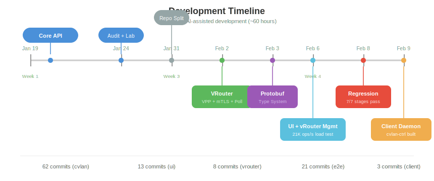
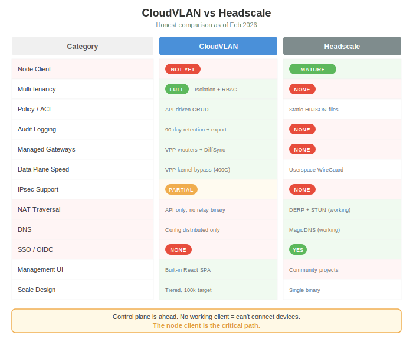

# Project Status

> Last updated: Feb 9, 2026

## State of the Project

3 weeks of development, ~60 hours of AI-assisted building with Claude Code. The focus has been depth over breadth — getting the control plane, gateway, and build infrastructure right before rushing to end-to-end connectivity.

### What's Built

- **Control plane API** (cvlan-api) — multi-tenancy with tenant isolation, RBAC (4 roles), Ed25519 registration tokens, mTLS via step-ca, audit logging with 90-day retention, background job scheduler, IP allocation with per-CVLAN mutex (21K ops/s at 200 concurrency), tiered server modes for DDoS resilience
- **VPP gateway** (vrouterd) — VPP 24.10 kernel-bypass data plane, mTLS registration + poll loop, DiffSync reconciliation, bootstrap mode for testing without VPP hardware
- **Management UI** — React 18 + TypeScript + Vite, all entity CRUD pages (tenants, CVLANs, nodes, users, groups, policies, vrouters, regions, relays, audit logs)
- **Client control plane daemon** (cvlan-ctrl) — discovery, registration, poll loop, SQLite state, proper Curve25519 WG key generation
- **CLI tools** — cvlanctl (admin CLI), vrouterctl (gateway debug CLI)
- **Build infrastructure** — Docker singleton containers, regression suite (7 stages, accept/reject voting), E2E test stack
- **Protocol Buffers** — Single source of truth for type definitions, generates Rust + TypeScript simultaneously

### What's Not Built Yet

- **Client data plane** (cvland) — WireGuard tunnels via boringtun (stub only)
- **End-to-end connectivity** — No device can connect to another device yet
- **NAT traversal** — No DERP relay, no STUN
- **DNS** — Config distributed but no resolver
- **SSO/OIDC** — Not implemented
- **IPsec** — VPP supports it, but not wired up end-to-end

## Implementation Matrix

| Component | Repo | Binary | Status | Tests | Coverage |
|-----------|------|--------|--------|-------|----------|
| cvlan-api | cvlan | cvlan-api | Working | 199 unit + 328 integration | 47.5% |
| cvlanctl | cvlan | cvlanctl | Working | via integration | — |
| Management UI | ui | — | Working | eslint clean | — |
| vrouterd | vrouter | vrouterd | Working | VPP integration | — |
| vrouterctl | vrouter | vrouterctl | Working | — | — |
| cvlan-ctrl | client | cvlan-ctrl | Built | 11 unit | — |
| cvland | client | cvland | Stub | 1 test | — |
| cvlancli | client | cvlancli | Stub | 0 | — |
| Relay | — | — | Not started | — | — |
| E2E suite | e2e | — | Working | 6 scenarios | — |
| Regression | e2e | — | 7/7 pass | — | 25.5% aggregate |

## vs Headscale

An honest comparison of where CloudVLAN and Headscale stand today.

### Where CloudVLAN is Ahead

- **Multi-tenancy** — Full tenant isolation with RBAC. Headscale has a flat, single-tenant model.
- **Policy engine** — API-driven CRUD with group-based ACLs. Headscale uses static HuJSON files.
- **Audit logging** — 90-day retention with export. Headscale has none.
- **Managed gateways** — VPP-based vrouters with IPsec support. Headscale has no managed gateway concept.
- **Scale design** — Tiered architecture targeting 100k+ nodes. Headscale is a single binary.
- **Management UI** — Built-in React SPA. Headscale relies on community projects.
- **Data plane speed** — VPP kernel-bypass (400Gbps capable). Headscale uses userspace WireGuard.

### Where Headscale is Ahead

- **Working client** — Reuses the actual Tailscale client. CloudVLAN has no working client agent yet.
- **NAT traversal** — DERP + STUN with working hole-punching. CloudVLAN has API only, no relay binary.
- **DNS** — MagicDNS resolver works. CloudVLAN distributes config but has no resolver.
- **SSO/OIDC** — Supported. CloudVLAN has none.
- **Ecosystem** — Helm charts, Terraform providers, battle-tested deployments.

### Bottom Line

The control plane is significantly ahead. But without a working client, users cannot connect devices. **The node client is the critical path.**

## Repository Stats

| Repository | Commits | Tests | Purpose |
|------------|---------|-------|---------|
| cvlan | 62 | 527 (199u + 328i) | Control plane API + CLI |
| ui | 13 | eslint clean | Management frontend |
| vrouter | 8 | VPP integration | VPP gateway |
| e2e | 21 | 6 E2E + 7 regression stages | Testing infrastructure |
| client | 3 | 13 unit | VPN client (3 crates) |

**Total: 100+ commits, 8 Rust crates, 7 binaries, 527+ tests, 47.5% line coverage**

## What's Next (Critical Path to First Connection)

1. **Client data plane** (cvland) — boringtun WireGuard tunnels
2. **Node-VRouter connectivity** — nodes see vrouters as peers in poll response
3. **End-to-end test** — laptop → cvlan-ctrl → tunnel → vrouter → other laptop
4. **NAT traversal** — DERP relay for clients behind NAT
5. **DNS resolver** — resolve peer names to tunnel IPs
6. **REST API proto3 JSON compliance** — pbjson canonical mapping

## Open Items

### Node-VRouter Connectivity
- `get_peers_for_cvlan` should include vrouters assigned to the CVLAN
- Nodes need vrouter's WG pubkey in their peer list (hub-and-spoke)
- Node poll response should include vrouter endpoints

### REST API Proto3 Compliance
- REST handlers return `models::` types (snake_case) — should return `gen::` types (camelCase)
- Follow proto3 canonical JSON mapping via pbjson
- Update UI and integration tests to match

### Client Packaging
- Remove unused dpkg-dev from Dockerfile
- Validate --arch argument in build scripts
- Fix systemd unit file formatting

## Development Log

| Date | What Was Achieved |
|------|-------------------|
| **Jan 19** | Project inception — initial commit, documentation, architecture planning |
| **Jan 20** | Core API implementation complete: 30 integration tests passing, CLAUDE.md, build system optimized |
| **Jan 21** | React management UI created, comprehensive audit logging on all REST handlers, configurable connection pool |
| **Jan 24** | Tiered coordination architecture designed (discovery/registration/session), lab infrastructure plan, dbctl script, 16K ops/sec audit throughput |
| **Jan 25** | Code coverage support with LLVM instrumentation (~21% line coverage) |
| **Jan 30** | PostgreSQL query optimization with RETURNING clause |
| **Jan 31** | Major repo split — UI extracted to standalone repo, vrouter repo created with VPP integration, singleton container build pattern |
| **Feb 1** | RBAC enforcement, email/password auth with security hardening, persistent job scheduler, 90-day audit log retention |
| **Feb 2** | VRouter integration — poll loop with peer data, step-ca mTLS, join tokens, IP allocation test suite (100 unit + 50 integration), bootstrap mode, DiffSync persistence |
| **Feb 3** | Protocol Buffers infrastructure — 13 proto files, buf + prost + ts-proto pipeline, Rust types (74KB) + TypeScript types (15 files), conversion traits |
| **Feb 4** | Migrated vrouter protocol to protobuf, removed unused cvlan-types crate |
| **Feb 5** | Fixed IP allocation race condition with atomic counter increment |
| **Feb 6** | Big feature day — global vRouter CRUD + tenant assignment, per-CVLAN mutex IP allocator (21K ops/s at 200 concurrency), 67 new unit tests + 31 integration tests, VPP 24.10 socket API protocol, removed cAdvisor security risk |
| **Feb 7** | Regression suite architecture — dockerenv guards for singleton container exec, clippy/rustfmt in build Dockerfiles |
| **Feb 8** | Dual-backend coverage — all integration tests on Postgres + SQLite, UUID BLOB storage, busy_timeout, cargo fmt (83 files), full regression suite green (7/7 stages), 47.5% line coverage baseline |
| **Feb 9** | cvlan-ctrl client daemon — discovery/register/poll loop, SQLite state, x25519-dalek WG keys, MAC detection. Docs rewrite — 23 SVG diagrams, 18 markdown files |

## Key Architecture Decisions

| Decision | Date | Rationale |
|----------|------|-----------|
| Tiered server architecture | Jan 24 | DDoS resilience: separate discovery/registration/session modes |
| Ed25519 registration tokens | Jan 24 | Server-authoritative CVLAN assignment, offline signing |
| step-ca for mTLS | Feb 2 | Lightweight CA, auto-renewal, no manual cert management |
| Per-CVLAN mutex IP allocation | Feb 6 | Replaced retry-based with lock-based, 21K ops/s at 200 concurrency |
| Protocol Buffers as type source | Feb 3 | Single source of truth eliminates Rust/TypeScript drift |
| VPP 24.10 socket API | Feb 6 | Binary API over unix socket, no shared memory needed |
| SQLite dual-backend | Feb 8 | Self-hosted single-box deploys without Postgres dependency |
| Three-crate client architecture | Feb 9 | Independent upgrade of control plane vs data plane |
| x25519-dalek for WG keys | Feb 9 | Proper Curve25519 instead of random bytes |
