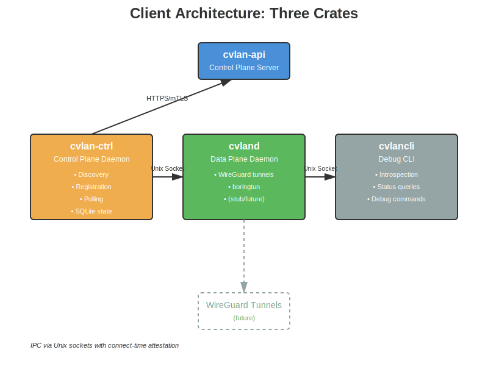
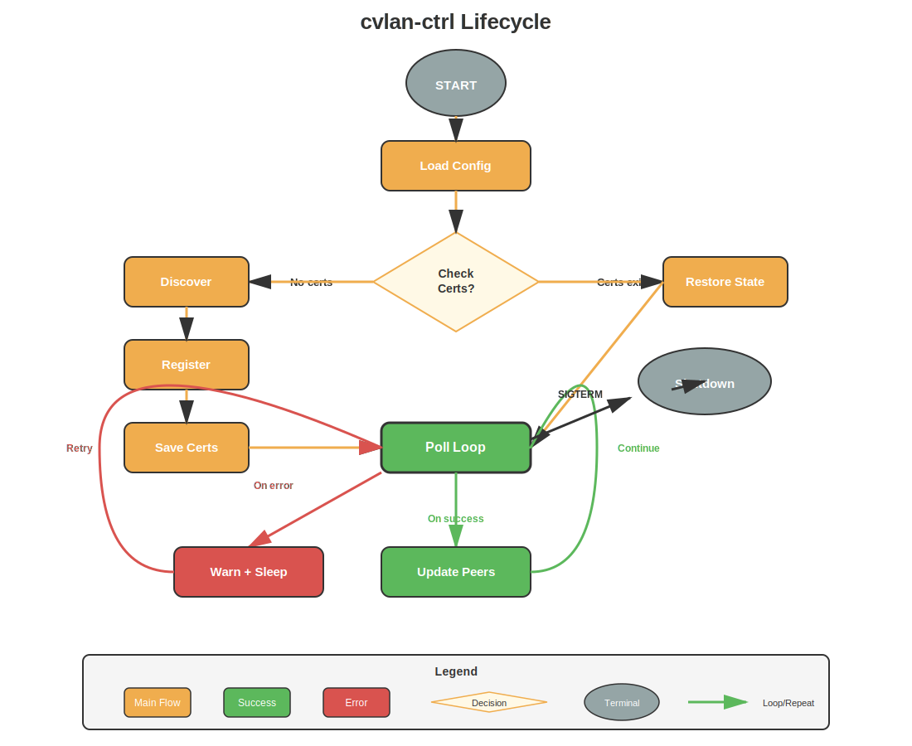
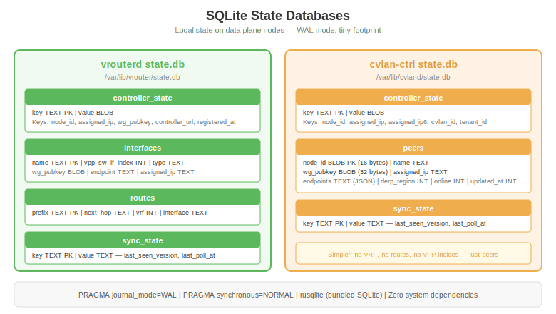

# Client Architecture

The VPN client is split into three separate crates, each a separate binary. This separation allows independent upgrades of the control plane logic without touching the data plane, and provides a clean debug interface.

## Three-Crate Architecture



| Crate | Binary | Role | Runs As |
|-------|--------|------|---------|
| **cvlan-ctrl** | cvlan-ctrl | Control plane daemon | Long-running service |
| **cvland** | cvland | Data plane daemon | Long-running service |
| **cvlancli** | cvlancli | Debug/introspection CLI | On-demand |

### cvlan-ctrl (Control Plane)

Handles all communication with the controller:
- **Discovery** — Find the controller URL via discovery endpoint
- **Registration** — Register with Ed25519 token, receive cert + key + CA chain + IP + peers
- **Polling** — Periodic poll for peer updates, policy changes, DNS config
- **State** — SQLite database for node identity, peer cache, sync state

cvlan-ctrl is the first thing that runs. It establishes identity, gets certificates, and caches the peer list. It then pushes peer configuration to cvland via Unix socket IPC.

### cvland (Data Plane)

Handles actual WireGuard tunnels:
- **boringtun** — Userspace WireGuard implementation (future)
- **Tunnel management** — Create/destroy tunnels based on peer config from cvlan-ctrl
- **Packet forwarding** — Route traffic through tunnels

cvland receives its configuration from cvlan-ctrl (not directly from the controller). This means cvland doesn't need network access to the controller — only cvlan-ctrl does.

**Status**: Stub. Data plane implementation is the critical path.

### cvlancli (Debug CLI)

Introspection tool for operators:
- Query cvlan-ctrl for registration status, peer list, sync state
- Query cvland for tunnel status, traffic stats
- Connects via Unix socket IPC

**Status**: Stub.

## Client Lifecycle



```
1. Start cvlan-ctrl
2. Load config (YAML + env vars)
3. Generate WG keypair (x25519-dalek, Curve25519)
4. Check for existing certificates:
   ├── YES → Resume: create mTLS client, restore node_id from state.db
   └── NO  → Bootstrap:
              a. Discover controller URL (if discovery_url configured)
              b. Register with Ed25519 token + WG pubkey + MAC
              c. Save certificates to disk (cert, key 0o600, CA chain)
              d. Store node_id, assigned_ip, cvlan_id in state.db
              e. Cache initial peer list
5. Main poll loop (every 30 seconds):
   a. Send: MAC, nonce, endpoints, last_seen_version
   b. Receive: peer changes, policy updates, DNS config
   c. Update state.db with changes
   d. (Future: push config to cvland via IPC)
6. Graceful shutdown on SIGTERM/SIGINT
```

## Configuration

```yaml
# /etc/cvland/cvlan-ctrl.yaml
bootstrap:
  discovery_url: "https://discovery.cloudvlan.io"    # optional
  registration_token: "eyJ..."                        # or CVLAND_REGISTRATION_TOKEN env
  tenant: "acme"                                      # or CVLAND_TENANT env

control_plane:
  url: "https://api.cloudvlan.io"                     # fallback if no discovery
  poll_interval_secs: 30
  connect_timeout_secs: 10
  request_timeout_secs: 30

mtls:
  cert_path: "/var/lib/cvland/certs/client.crt"
  key_path: "/var/lib/cvland/certs/client.key"
  ca_chain_path: "/var/lib/cvland/certs/ca-chain.pem"

state:
  db_path: "/var/lib/cvland/state.db"

ipc:
  socket_path: "/var/run/cvland/ctrl.sock"
```

All bootstrap fields support environment variable fallbacks (`CVLAND_*`).

## State Database



cvlan-ctrl uses SQLite (WAL mode, rusqlite bundled):

| Table | Purpose |
|-------|---------|
| `controller_state` | Key-value: node_id, assigned_ip, cvlan_id, tenant_id |
| `peers` | Cached peer list: node_id, wg_pubkey, assigned_ip, endpoints |
| `sync_state` | Last seen version, last poll timestamp |

Simpler than vrouterd's state (no VRF, no routes, no VPP indices — just peers).

## IPC (Unix Sockets)

Communication between the three crates uses Unix sockets with connect-time attestation:

```
cvlan-ctrl ←→ cvland    (peer config push)
cvlan-ctrl ←→ cvlancli  (status queries)
cvland     ←→ cvlancli  (tunnel stats)
```

**Status**: Config fields exist, actual IPC protocol not yet implemented.

## Key Design Decisions

- **x25519-dalek for WG keys** — Proper Curve25519, not random bytes. `StaticSecret::random_from_rng()` + `PublicKey::from(&secret)`.
- **30s poll interval** — Clients are less chatty than vrouters (5s). Saves server resources at scale.
- **Bundled SQLite** — Zero system dependencies. Binary is self-contained.
- **MAC address detection** — Linux: `/sys/class/net/*/address`, macOS: `ifconfig en0`. Used for registration binding.
- **Certificate persistence** — On restart, if certs exist, skip registration and resume polling.

## Repository Structure

```
client/
├── cvlan-ctrl/         # Control plane daemon
│   ├── src/
│   │   ├── main.rs     # Thin orchestration (bootstrap → register → poll loop)
│   │   ├── lib.rs      # Library re-exports for tests
│   │   ├── config.rs   # Configuration (YAML + env)
│   │   ├── state.rs    # SQLite state
│   │   ├── crypto.rs   # WG keypair generation, nonces, hex encoding
│   │   ├── system.rs   # MAC address detection, hostname
│   │   ├── logging.rs  # Tracing subscriber setup
│   │   └── api/        # HTTP client + types + state helpers
│   └── tests/
│       └── mock_controller.rs  # 39 integration tests (wiremock)
├── cvland/             # Data plane daemon (stub)
├── cvlancli/           # Debug CLI (stub)
├── config/             # Reference config templates
└── build/              # Docker build infrastructure
```

**Tech stack**: Rust + x25519-dalek + rusqlite + reqwest + rustls

**Binary size**: < 5MB release (LTO + strip)

**Test coverage**: 56% line coverage (config 98%, state 96%, crypto 100%, logging 100%, system 91%)
