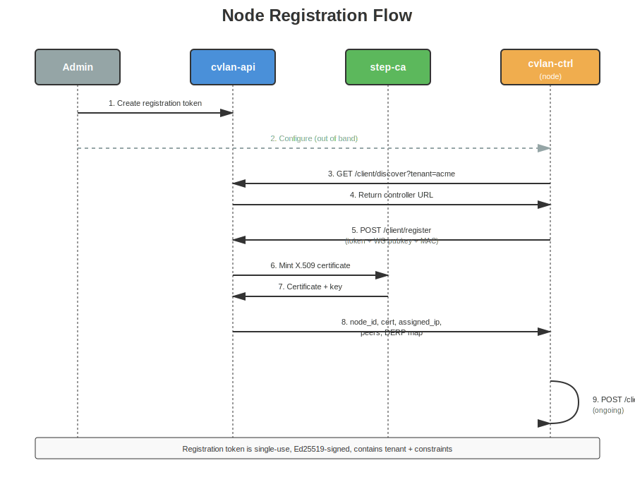
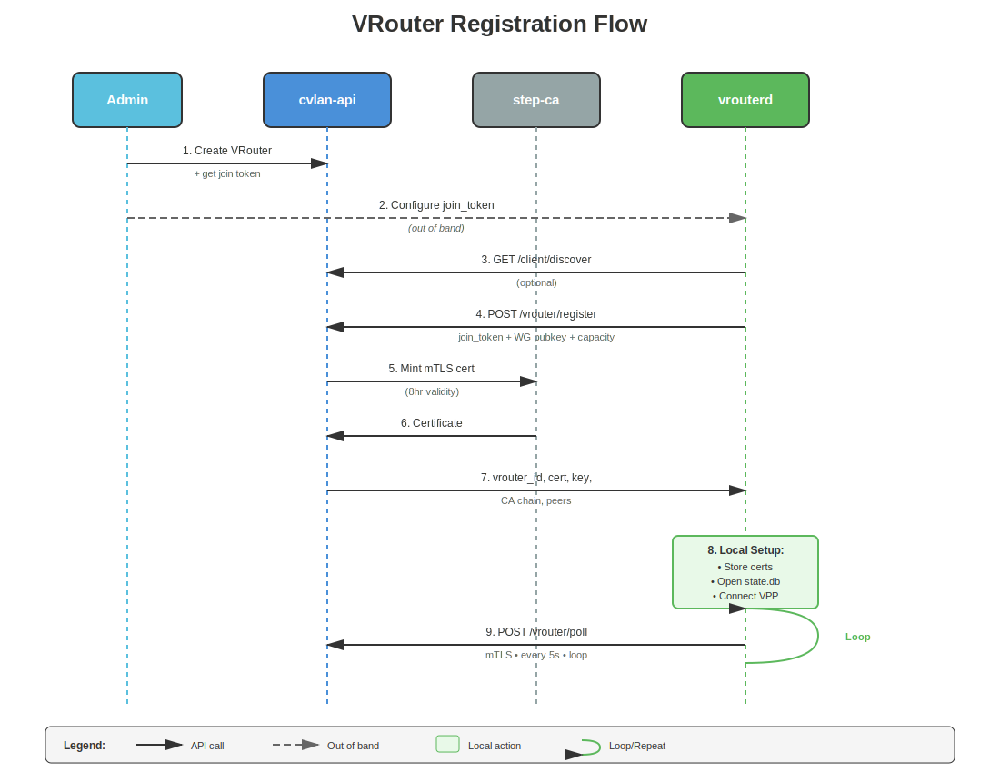

# Node Registration

How nodes (clients and vrouters) join the network. This is the core protocol that establishes identity, assigns IPs, and distributes peer information.

## Overview

The registration protocol is **server-authoritative**: the admin decides which CVLAN a node joins by encoding it in the registration token. The node never specifies its desired network — it just presents the token and gets assigned.

## Client Registration Flow



### Step-by-step

1. **Admin creates a CVLAN** with a CIDR range (e.g., 10.100.0.0/24)
2. **Admin creates a registration token** — The server signs a token with the tenant's Ed25519 private key. The token encodes the target CVLAN.
3. **Node starts cvlan-ctrl** with the token in its config (or `CVLAND_REGISTRATION_TOKEN` env var)
4. **Discovery** (optional) — If `discovery_url` is configured, node calls `GET /client/discover?tenant=<slug>` to find the controller URL. Otherwise it uses `control_plane.url` directly.
5. **Registration** — Node calls `POST /client/register` with:
   - Registration token (Ed25519 signed)
   - WireGuard public key (Curve25519, base64 encoded)
   - MAC address + nonce (for replay protection)
   - Hostname, OS info, agent version
   - Endpoints (IP:port pairs for direct connectivity)
6. **Server verifies** the token signature using the tenant's public key, extracts the target CVLAN
7. **Server allocates an IP** from the CVLAN's CIDR range
8. **Server creates a certificate** via `StepCaClient::mint_client_cert()` — tries step-ca CLI first, falls back to self-signed (openssl) for dev/e2e
9. **Server responds** with:
   - Node ID (UUID)
   - Client certificate + private key + CA chain (all real X.509 PEM)
   - Assigned IPv4 and IPv6 addresses
   - CVLAN info (name, CIDR, peers)
   - Initial peer list (all other nodes in the same CVLAN)
   - DERP map and DNS config (if configured)
10. **Node saves certificates** to disk (key file with 0o600 permissions)
11. **Node stores identity** in SQLite: node_id, assigned_ip, cvlan_id
12. **Node creates mTLS client** and begins polling

## VRouter Registration Flow



VRouter registration is similar but uses a different endpoint and join token mechanism:

1. Admin creates a VRouter entity in the API (assigns to a region)
2. Admin retrieves the join token from the VRouter record
3. vrouterd starts with the join token
4. vrouterd calls `POST /vrouter/register` with token + WG pubkey
5. Server issues a short-lived mTLS certificate (8 hours via step-ca)
6. vrouterd saves certs, begins polling every 5 seconds

Key differences from client registration:
- **Certificate validity**: 8 hours (vs 1 year for clients) — forces regular re-registration
- **Poll interval**: 5 seconds (vs 30 seconds for clients) — gateways need faster convergence
- **Config payload**: Includes VPP-specific parameters (interfaces, routes, VRFs)

## Ed25519 Token Model

The registration token is an Ed25519-signed JSON blob:

```json
{
  "tenant_id": "uuid",
  "cvlan_id": "uuid",
  "created_at": "2026-02-09T10:00:00Z",
  "expires_at": "2026-02-16T10:00:00Z"
}
```

- **Signing**: Tenant's Ed25519 private key (kept offline or in admin's custody)
- **Verification**: Controller has the tenant's public key stored in the database
- **Server-authoritative CVLAN**: The `cvlan_id` in the token determines which network the node joins — the node has no say

## Poll Protocol

After registration, nodes poll for updates:

```
POST /client/poll
Headers:
  X-Node-Id: <uuid>
  (mTLS client certificate)

Body:
{
  "mac": "aa:bb:cc:dd:ee:ff",
  "nonce": "<random-32-byte-hex>",
  "endpoints": [{"host": "1.2.3.4", "port": 51820}],
  "derp_region": 1,
  "last_seen_peers": ["uuid1", "uuid2"],
  "last_seen_version": 42
}

Response:
{
  "version": 43,
  "keepalive": false,
  "peers": [{ added/changed peers }],
  "peers_removed": ["uuid3"],
  "derp_map": { ... },
  "dns_config": { ... },
  "packet_filter": [{ ... }]
}
```

**Delta updates**: The server only sends changes since `last_seen_version`. If nothing changed, it returns `keepalive: true` with no peer data. This keeps bandwidth minimal for idle networks.

**Nonce**: Fresh random bytes on every poll request. Prevents replay attacks.

## Certificate Lifecycle


Certificates are issued by step-ca (a lightweight ACME-compatible CA). Both client and vrouter use the same code path: `StepCaClient` tries the step CLI first, then falls back to openssl self-signed certs. The generic helpers (`mint_via_step_cli_generic`, `generate_self_signed_generic`) accept a subject CN and SAN, so client certs get `CN=node-{id}` / `SAN=node:{id}` while vrouter certs get `CN=vrouter-{id}` / `SAN=vrouter:{id}`.

| Property | Client | VRouter |
|----------|--------|---------|
| Validity | 1 year (8760h) | 8 hours |
| Issuer | step-ca (self-signed fallback) | step-ca (self-signed fallback) |
| Subject CN | `node-{uuid}` | `vrouter-{uuid}` |
| SAN | `node:{uuid}` | `vrouter:{uuid}` |
| Key storage | /var/lib/cvland/certs/ | /var/lib/vrouterd/certs/ |
| Key permissions | 0o600 | 0o600 |
| Renewal | Re-register on expiry | Re-register every 8 hours |
| Binding | SHA256(mac + nonce) | SHA256(mac + nonce) |
| Response field | `ca_chain` | `ca` (in CertificateResponse) |

Private keys are generated server-side by step-ca (or openssl) and returned to the node during registration. The CA chain is stored locally for certificate verification.

## Authentication Decision Tree


Which auth mechanism is used depends on who's calling:

| Caller | Mechanism | Endpoint |
|--------|-----------|----------|
| New node (unregistered) | Ed25519 token | POST /client/register |
| Registered node | mTLS certificate | POST /client/poll |
| Human / UI | JWT bearer token | All /api/v1/* |
| CLI / automation | API key | All /api/v1/* |
| Anyone | None (rate-limited) | GET /client/discover |

## Tailscale Compatibility

The poll response includes fields compatible with Tailscale's coordination protocol (DERP maps, DNS config, packet filters). This is intentional — it leaves the door open for future Tailscale client compatibility, similar to how Headscale works.

Key aliases:
- `DerpMap` / `DerpRegion` / `DerpNode` — Same structure as Tailscale
- `PacketFilterRule` — Same allow/deny model
- `DnsConfig` — Same resolver configuration
