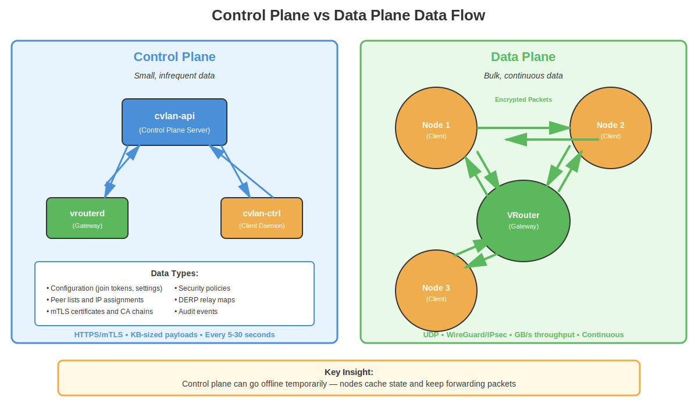
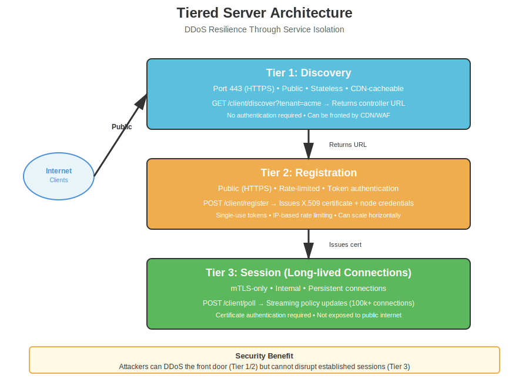
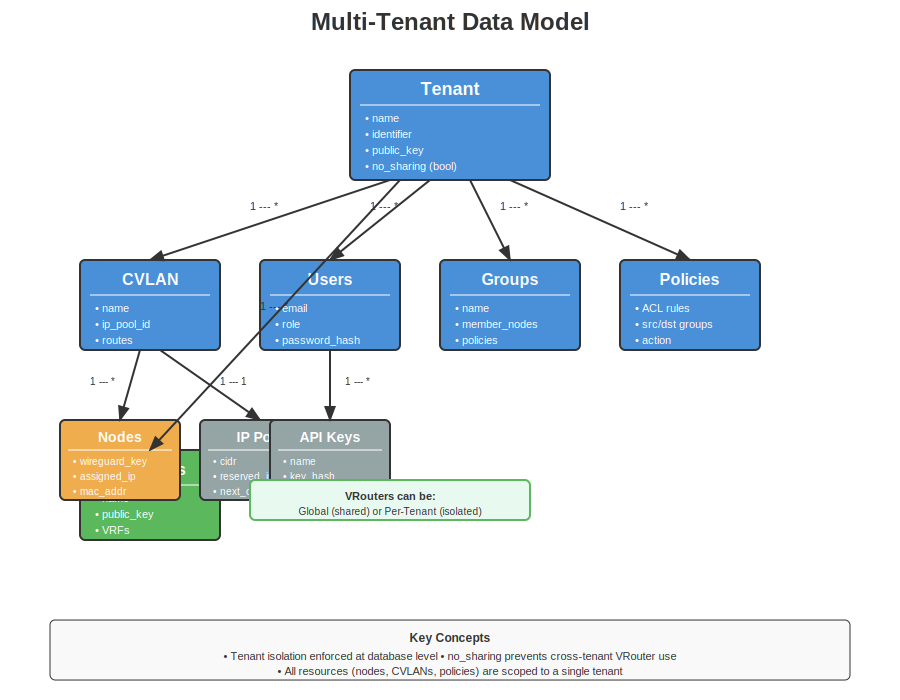
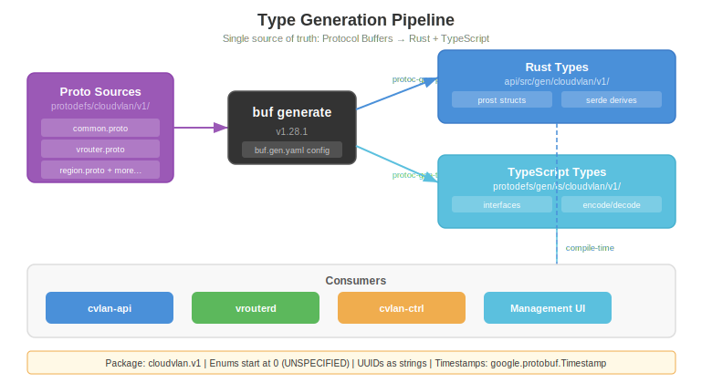

# System Overview

CloudVLAN is a server-authoritative overlay network. The server controls everything — which CVLAN a node joins, what IP it gets, which peers it can reach, and what policies apply. Nodes don't choose; they register with a token and receive their configuration.

## System Topology


The system splits into two planes:

- **Control plane** — cvlan-api handles all management: tenant isolation, node registration, policy enforcement, IP allocation, audit logging. The management UI and cvlanctl CLI both talk to the same REST API.
- **Data plane** — vrouterd (VPP gateways) and client nodes (cvlan-ctrl + cvland) handle actual traffic. They connect to the control plane via mTLS for configuration, then form WireGuard tunnels between each other.

## How It Connects



**Control plane traffic** (HTTPS/mTLS):
- UI/CLI → cvlan-api: REST API calls for management
- Nodes → cvlan-api: Registration (Ed25519 token), then periodic polling (mTLS) for peer updates
- VRouters → cvlan-api: Same registration + poll pattern, but with step-ca issued certificates

**Data plane traffic** (WireGuard):
- Node ↔ Node: Direct WireGuard tunnels (mesh)
- Node ↔ VRouter: WireGuard tunnels (hub-and-spoke for site connectivity)
- Fallback: Via relay (not yet built) when direct connection fails

## Repository Structure


Five repositories, eight Rust crates, seven binaries:

| Repo | Crates | Binaries | Purpose |
|------|--------|----------|---------|
| cvlan/ | api, cvlanctl, protodefs | cvlan-api, cvlanctl | Control plane + admin CLI |
| vrouter/ | vrouterd, vrouterctl, vrouter-gen | vrouterd, vrouterctl | VPP gateway + debug CLI |
| client/ | cvlan-ctrl, cvland, cvlancli | cvlan-ctrl, cvland, cvlancli | VPN client (3 crates) |
| ui/ | — | — | React 18 + TypeScript frontend |
| e2e/ | — | — | E2E tests + regression suite |

## Server-Authoritative Model

CloudVLAN uses a server-authoritative model (unlike Tailscale's coordinator model):

1. **Admin creates a CVLAN** with a CIDR range (e.g., 10.100.0.0/24)
2. **Admin generates a registration token** — Ed25519 signed, encodes the target CVLAN
3. **Node registers with the token** — server verifies the signature, extracts the CVLAN, assigns an IP, issues an mTLS certificate
4. **Node polls for updates** — receives peer list, policy changes, DNS config via delta updates
5. **Server controls everything** — IP allocation, peer visibility, policy enforcement

The node never specifies which CVLAN it wants. The token carries that information, signed by the tenant's private key.

## Tiered Server Architecture



cvlan-api can run in different modes, each exposing only the endpoints needed:

| Mode | Purpose | Auth | Exposure |
|------|---------|------|----------|
| **Discovery** | Find the controller URL | None (rate-limited) | Public internet (port 443) |
| **Registration** | Register new nodes | Ed25519 token | Semi-public |
| **Session** | Poll for updates | mTLS certificate | Internal / VPN |
| **Controller** | Full REST API | JWT / API key | Admin access |
| **Combined** | All of the above | Mixed | Development / small deploys |

This separation means DDoS on the discovery endpoint doesn't affect registered nodes, and the session tier can require mTLS (impossible to reach without a valid certificate).

## Multi-Tenancy



Every resource belongs to a tenant. Tenants are fully isolated — a query in tenant A never sees tenant B's data. The hierarchy:

```
Tenant
├── CVLANs (each with its own CIDR, isolated IP space)
│   ├── Nodes (assigned IPs within the CVLAN's CIDR)
│   └── IP allocation state (per-CVLAN mutex)
├── Users (with roles: superadmin, tenantadmin, member, readonly)
├── Groups (for policy targeting)
├── Policies (group-based ACLs: allow/deny between groups)
├── API Keys (scoped, Argon2-hashed)
└── Audit Logs (90-day retention)

VRouters and Regions are global (managed by superadmin).
```

## Protocol Buffers



All shared types are defined once in Protocol Buffers (protodefs/) and generated into both Rust and TypeScript. This eliminates drift between the API server, gateway, client, and UI.

## What's Working vs Planned

| Layer | Status |
|-------|--------|
| Control plane API | Working — full CRUD, multi-tenancy, RBAC, audit, IP allocation |
| Management UI | Working — all entity pages |
| VPP Gateway | Working — registration, poll, DiffSync, bootstrap mode |
| Client control plane | Built — discovery, registration, poll loop |
| Client data plane | Stub — boringtun WireGuard tunnels next |
| End-to-end connectivity | Not yet — critical path |
| NAT traversal (relay) | Not started |
| DNS resolver | Not started |
