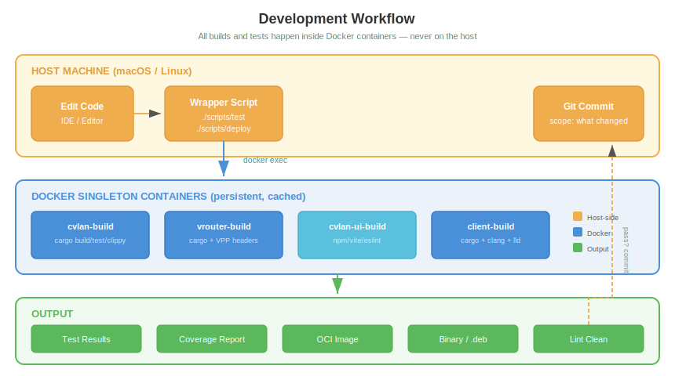
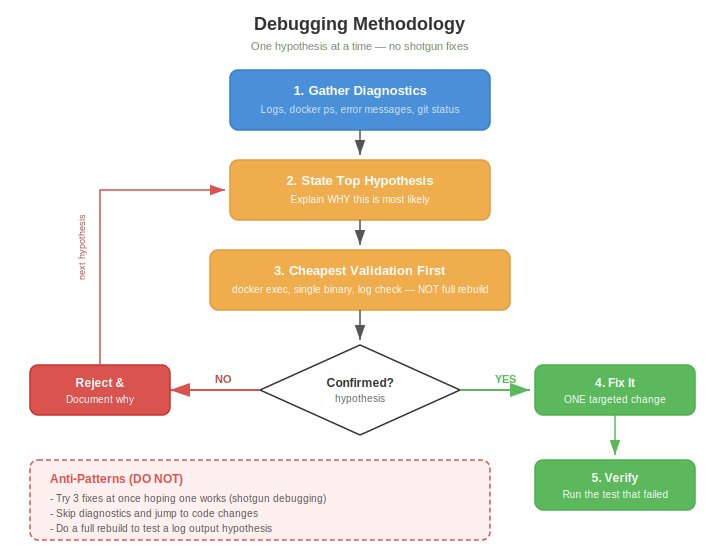
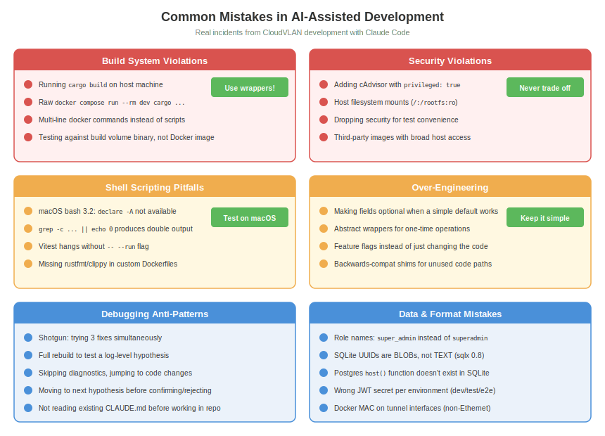

# Developer Guide

> Everything you need to contribute to CloudVLAN effectively.

## Development Environment



All builds and tests happen inside Docker containers. Cargo, npm, and protoc never run on the host machine. Each repo has a persistent **singleton container** that preserves caches between builds for fast incremental compilation.

### Containers

All Rust build containers use `ubuntu:24.04` as base with pinned toolchains for hermetic builds. Rust is installed via rustup (not the `rust:` Docker image).

| Container | Repo | Base | Rust | Key Tools |
|-----------|------|------|------|-----------|
| **cvlan-build** | cvlan/ | ubuntu:24.04 | 1.93.0 | cargo, sqlx, protoc, buf v1.28.1, clippy, rustfmt, cargo-llvm-cov 0.8.4 |
| **vrouter-build** | vrouter/ | ubuntu:24.04 | 1.85.0 | cargo, VPP 24.10 headers, buf v1.47.2, clippy, rustfmt |
| **cvlan-ui-build** | ui/ | node:20-alpine | — | npm, vite, eslint, vitest, buf v1.47.2, ts-proto 2.11.2, chromium |
| **client-build** | client/ | ubuntu:24.04 | 1.85.0 | cargo, clang, lld, cross-compile (x86_64 + aarch64), buf v1.47.2 |

Protobuf tooling is consistent: `protoc-gen-prost` 0.5.0 and `protoc-gen-prost-serde` 0.4.0 across all Rust containers.

### First Time Setup

```bash
# Full stack (all services)
cd ~/ws/e2e && make build-all && make up

# Individual component development
cd ~/ws/cvlan && ./scripts/deploy        # API on :8081, token in build/.dev-token
cd ~/ws/ui && ./build/scripts/dev.sh     # UI on :3000 (hot reload)
cd ~/ws/client && make build             # Build all three client crates
```

### Image Rebuilds

When working with the E2E stack or regression suite, use the dedicated build scripts:

```bash
~/ws/e2e/scripts/build-cvlan      # Rebuild cvlan-api image
~/ws/e2e/scripts/build-vrouter    # Rebuild vrouter image
~/ws/e2e/scripts/build-ui         # Rebuild UI image
~/ws/e2e/scripts/build-client     # Rebuild client image
~/ws/e2e/refresh                  # Update one container in E2E stack
```

`./scripts/test` (non-coverage mode) does NOT rebuild the Docker image — it runs tests against what's already built. If you changed code and need to test the built image, rebuild first.

---

## Repository Layout

Five repositories, eight Rust crates, seven binaries:

| Repo | Crates | Binaries | Purpose | CLAUDE.md |
|------|--------|----------|---------|-----------|
| `cvlan/` | api, cvlanctl, protodefs | cvlan-api, cvlanctl | Control plane + admin CLI | `cvlan/CLAUDE.md` |
| `vrouter/` | vrouterd, vrouterctl, vrouter-gen | vrouterd, vrouterctl | VPP gateway + debug CLI | `vrouter/CLAUDE.md` |
| `client/` | cvlan-ctrl, cvland, cvlancli | cvlan-ctrl, cvland, cvlancli | VPN client (3 crates) | `client/CLAUDE.md` |
| `ui/` | — | — | React 18 + TypeScript frontend | `ui/CLAUDE.md` |
| `e2e/` | — | — | E2E tests + regression suite | `e2e/CLAUDE.md` |

**Always read the repo-specific CLAUDE.md** before working in a component. Each contains JWT secrets, build commands, and component-specific context.

### Key Architecture

```
CONTROL PLANE
┌──────────────────────────────────────────────────────────────┐
│  cvlan-api (REST + node registration + policy + audit)       │
│  Multi-tenant RBAC │ Scheduler │ IP allocation │ mTLS        │
└──────────────────────────┬───────────────────────────────────┘
                           │ HTTPS / mTLS
DATA PLANE                 │
┌──────────────────────────┴───────────────────────────────────┐
│  vrouterd         cvlan-ctrl+cvland   relay (future)         │
│  (VPP gateway)    (client node)       (NAT traversal)        │
└──────────────────────────────────────────────────────────────┘
```

---

## Build System

### The Golden Rules

1. **NEVER run `cargo build`, `cargo test`, `npm install` on the host**
2. **NEVER run raw `docker compose -f build/docker-compose.yml run --rm dev cargo ...`**
3. **NEVER write multi-line docker commands** — always use wrapper scripts
4. **Always use the repo's wrapper scripts** — they handle container lifecycle, volumes, and environment

### Per-Repo Build Commands

**cvlan/**
```bash
./scripts/build          # Compile cvlan-api + cvlanctl
./scripts/test           # Integration tests (no coverage)
./scripts/test --coverage   # Integration tests with LLVM coverage
./scripts/test --unit       # Unit tests only
./scripts/test --load       # Load tests (21K ops/sec target)
./scripts/deploy         # Build + start dev server (:8081)
./scripts/lint           # clippy + rustfmt check
```

**vrouter/**
```bash
make build               # Compile vrouterd + vrouterctl
make test                # Unit tests
make test-vpp            # VPP integration tests
```

**ui/**
```bash
./build/scripts/dev.sh          # Dev server with hot reload (:3000)
./build/scripts/build-oci       # Production Docker image
./build/scripts/lint.sh         # ESLint
./build/scripts/test.sh         # Vitest (uses -- --run to avoid watch mode)
```

**client/**
```bash
make build               # Compile all three crates
make test                # Unit tests
make test-integration    # Integration tests (wiremock)
```

### Docker Image vs Build Volume

This distinction matters: the test API runs from `cvlan-api:latest` **Docker image**, not the binary in the build volume. After code changes:
1. Rebuild the binary (via wrapper script)
2. Rebuild the Docker image (`~/ws/e2e/scripts/build-cvlan`)
3. Then run tests against it

---

## Testing

### Test Pyramid

| Level | Count | Where | What |
|-------|-------|-------|------|
| **Unit** | 199+ (cvlan) + 39 (client) | In-crate | Model validation, crypto, parsing |
| **Integration** | 328+ (cvlan) | `tests/integration/` | API endpoints, DB queries, multi-step flows |
| **Load** | 21K ops/sec | `tests/load/` | Concurrency, throughput, IP allocation |
| **E2E** | 12 scenarios | `e2e/` | Full stack with step-ca, Docker services |
| **Regression** | 7 stages | `e2e/regression/` | Build → static → unit → integration → load → e2e → coverage |

### Running Tests

```bash
# cvlan unit tests
cd ~/ws/cvlan && ./scripts/test --unit

# cvlan integration tests (starts Postgres + API automatically)
cd ~/ws/cvlan && ./scripts/test

# cvlan with coverage report
cd ~/ws/cvlan && ./scripts/test --coverage

# client integration tests
cd ~/ws/client && make test-integration

# E2E (full stack)
cd ~/ws/e2e && make build-all && make up && make test

# Regression suite (all 7 stages)
cd ~/ws/e2e/regression && ./run
```

### Coverage Targets

| Area | Target | Rationale |
|------|--------|-----------|
| Critical paths (auth, IP alloc, registration) | 90%+ | Bugs here break the product |
| Business logic (handlers, coordination) | 80%+ | Core domain |
| Plumbing (config, serialization) | 50-70% | Low risk |
| Generated code (protobuf) | Excluded | Not hand-written |

Current: cvlan 47.5% line coverage, client 56%. The regression suite rejects if aggregate drops > 2%.

### Dual-Backend Testing

Integration tests run on both **PostgreSQL** and **SQLite**, then coverage profiles are merged. SQLite-specific gotchas:
- UUIDs stored as BLOBs (not TEXT) — use `sql_uuid()` helper for portable WHERE clauses
- No `host()` function — use LIKE fallback
- Booleans are `1`/`0` (not `t`/`f`)
- `busy_timeout(5s)` required to prevent SQLITE_BUSY under write contention

---

## Code Conventions

### Rust

- **Async runtime**: Tokio (multi-threaded)
- **Error handling**: `thiserror` for libraries, `anyhow` for binaries
- **CLI parsing**: `clap` with derive macros
- **Serialization**: `serde` — JSON for API, YAML for config files
- **Database**: SQLx 0.8 (Postgres), rusqlite with `bundled` feature (SQLite)
- **Crypto**: x25519-dalek (Curve25519 keypairs), Ed25519 (token signing), Argon2 (password hashing)
- **No unsafe** unless absolutely necessary and well-documented
- **Formatting**: `cargo fmt --all` — enforced by regression suite
- **Linting**: `cargo clippy` — enforced by regression suite

### Naming

- Role values: `superadmin`, `tenantadmin`, `member`, `readonly` — **no underscores**
- Commit format: `scope: what changed` (e.g., `ipalloc: switch to atomic increment`)
- Binary names match crate names: `cvlan-api`, `cvlanctl`, `vrouterd`, `cvlan-ctrl`, etc.

### Protocol Buffers

All shared types are defined in `cvlan/protodefs/cloudvlan/v1/*.proto` and generated into Rust (prost) and TypeScript (ts-proto). Run `make generate` in the protodefs directory to regenerate.

### JWT Secrets by Environment

| Environment | Port | JWT Secret |
|-------------|------|------------|
| Dev (`./scripts/deploy`) | 8081 | `development-secret` |
| Test (`./scripts/test`) | 8080 | `test-secret-key-for-integration-tests` |
| E2E (`make up`) | 9080 | `e2e-test-secret` |

Using the wrong JWT secret is a common source of 401 errors.

---

## Git Conventions

- **Commit format**: `<scope>: <what changed>` — concise, specific, describes the actual change
- **Scope examples**: `api`, `ipalloc`, `coordination`, `build`, `e2e`, `ui`, `cvlan-ctrl`, `style`
- **Do NOT** add `Co-Authored-By: Claude` lines
- **Always verify** you're in the correct repo before committing (`git status`)
- **No generic messages** like "update code" or "fix bug" — say what you actually changed

Examples:
```
ipalloc: switch from FOR UPDATE to atomic increment for race-free allocation
coordination: add self-service node re-attestation via one-time code
build: switch to ubuntu 24.04 base with pinned toolchain and deps
style: cargo fmt --all
```

---

## Debugging Methodology



### The Process

1. **Gather diagnostics first** — don't jump to code changes
   - Check logs: `docker logs <container>`
   - Check state: `docker ps`, `git status`, error messages
   - Verify assumptions: which API is running? Which image? Which JWT secret?

2. **State your top hypothesis** — explain why it's most likely

3. **Cheapest validation first** — use `docker exec` into a running container, check a single log line, or add one print statement. Don't do a full rebuild to test whether a config value is wrong.

4. **One hypothesis at a time** — confirm or reject before moving to the next. Document why you rejected it.

5. **Fix with one targeted change** — then verify with the test that originally failed

### Tools

```bash
# Shell into build containers
docker exec -it cvlan-build bash
docker exec -it vrouter-build bash

# Shell into E2E service containers
cd ~/ws/e2e && ./scripts/shell-api
cd ~/ws/e2e && ./scripts/shell-vr

# Quick rebuild + refresh one service
cd ~/ws/e2e && ./refresh cvlan-api

# Check what's running
docker ps --format "table {{.Names}}\t{{.Status}}\t{{.Ports}}"
```

---

## Common Mistakes (Lessons from AI-Assisted Development)



These are real incidents from developing CloudVLAN with Claude Code. Every rule here was learned the hard way.

### Build System Violations

**Running cargo on the host** — Claude repeatedly attempted `cargo build` and `cargo test` directly on the host machine, bypassing the Docker container build system. This breaks because host toolchains may differ from container toolchains, and build artifacts are incompatible.

**Raw docker compose commands** — Instead of using `./scripts/test`, Claude would construct long `docker compose -f build/docker-compose.yml run --rm dev cargo test ...` commands. These miss environment variables, volume mounts, and container lifecycle management that the wrapper scripts handle.

**Multi-line docker commands** — Complex docker commands split across multiple lines are fragile and hard to maintain. Always wrap them in a script.

**Testing against the wrong binary** — The test API runs from the `cvlan-api:latest` Docker **image**, not the binary in the build volume. After code changes, you must rebuild the image or tests hit stale code. This caused multiple false-positive test passes.

### Security Violations

**The cAdvisor incident** — Claude added `gcr.io/cadvisor/cadvisor:v0.47.0` to the test compose with `privileged: true` and host filesystem mounts (`/:/rootfs:ro`, `/var/run:/var/run:ro`, `/sys:/sys:ro`). This exposed SSH keys, credentials, and the Docker socket. Nothing in the codebase even read from cAdvisor. It was removed immediately.

**Rule**: Never add privileged containers or host filesystem mounts for monitoring/debugging. Never drop security posture to pass a test.

### Shell Scripting Pitfalls

**macOS bash 3.2** — Claude used `declare -A` (associative arrays) which requires bash 4+. macOS ships bash 3.2 (GPLv2). Use `case` statements or function lookups instead.

**grep double output** — `grep -c pattern || echo 0` produces double output when grep finds no matches: the `0` from grep AND the `0` from echo. Use `grep -c pattern || true` instead.

**Vitest watch mode hang** — Running vitest without `-- --run` causes it to enter watch mode and hang forever. npm eats flags unless they're after `--`, so the correct invocation is `npm test -- --run`.

**Missing rustfmt/clippy** — Custom Dockerfiles based on `rust:latest` don't include rustfmt and clippy by default. They must be explicitly added with `rustup component add rustfmt clippy`.

### Over-Engineering

**Making fields optional when a default works** — When the user suggested "just create a system tenant", Claude instead proposed making 6 fields optional across 4 structs. The simpler approach was better.

**Abstract wrappers for one-time operations** — Claude created helper functions and traits for operations used exactly once. Three similar lines of code is better than a premature abstraction.

**Feature flags instead of changing the code** — When something needed to change, Claude added backwards-compatibility shims and feature flags instead of just changing it.

### Debugging Anti-Patterns

**Shotgun debugging** — Trying 3 different fixes simultaneously, then not knowing which one worked. This was explicitly called out multiple times.

**Full rebuild to test a log hypothesis** — When the question was "is this config value reaching the handler?", Claude would rebuild the entire image instead of using `docker exec` to check the running container.

**Skipping diagnostics** — Jumping straight to code changes without checking logs, container status, or error messages first.

### Data and Format Mistakes

**Role name underscores** — Using `super_admin` instead of `superadmin`. The role enum values have no underscores.

**Wrong JWT secret per environment** — Dev uses `development-secret`, test uses `test-secret-key-for-integration-tests`, E2E uses `e2e-test-secret`. Mixing them up causes 401 errors that look like code bugs.

**SQLite UUID format** — SQLite stores UUIDs as 16-byte BLOBs via sqlx 0.8, not as TEXT strings. Queries like `WHERE id = 'some-uuid-string'` silently match nothing. Use the `sql_uuid()` test helper.

**Docker MAC addresses on tunnel interfaces** — `detect_mac_address()` was picking up non-Ethernet addresses from Docker tunnel interfaces. Fixed by filtering for valid MAC formats.

---

## Environment Quick Reference

### Ports

| Service | Dev | Test | E2E |
|---------|-----|------|-----|
| cvlan-api | 8081 | 8080 | 9080 |
| Discovery | — | — | 9081 |
| UI | 3000 | — | 3000 |
| PostgreSQL | 5432 | 5432 | 5432 |

### Key Paths

| What | Where |
|------|-------|
| Workspace root | `~/ws/` |
| Dev token | `~/ws/cvlan/build/.dev-token` |
| Coverage report | `~/ws/cvlan/coverage/html/index.html` |
| Regression results | `~/ws/e2e/regression/results/` |
| Proto definitions | `~/ws/cvlan/protodefs/cloudvlan/v1/` |
| E2E test configs | `~/ws/e2e/config/` |
| Journal | `~/ws/journal.md` |
| Documentation | `~/ws/docs/` |

### CLI Wrappers

```bash
# cvlanctl (admin CLI via Docker)
cd ~/ws/cvlan && ./build/scripts/cvctl tenant list
cd ~/ws/cvlan && ./build/scripts/cvctl cvlan list -t my-tenant
cd ~/ws/cvlan && ./build/scripts/cvctl audit-log list --last 24h

# dbctl (database management)
cd ~/ws/cvlan && ./scripts/dbctl -backup ./backups/snapshot.sql
cd ~/ws/cvlan && ./scripts/dbctl -load ./backups/snapshot.sql
cd ~/ws/cvlan && ./scripts/dbctl -clean
```
