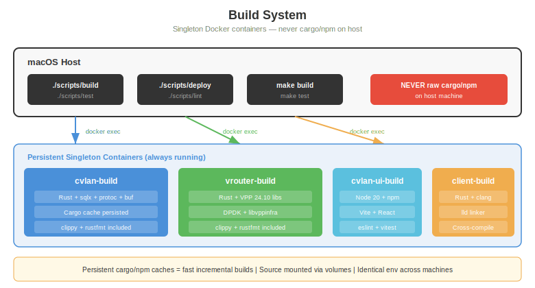

# Build System

All builds happen inside Docker containers. Cargo and npm never run on the host machine.

## Architecture



The build system uses **singleton containers** — persistent Docker containers that stay running between builds. This preserves cargo/npm caches for fast incremental compilation.

## Containers

All Rust build containers use `ubuntu:24.04` as base with pinned toolchains installed via rustup — not the `rust:` Docker image. This ensures hermetic, reproducible builds.

| Container | Base | Rust | Tools | Purpose |
|-----------|------|------|-------|---------|
| **cvlan-build** | ubuntu:24.04 | 1.93.0 | cargo, sqlx, protoc, buf v1.28.1, clippy, rustfmt, cargo-llvm-cov 0.8.4 | cvlan-api + cvlanctl |
| **vrouter-build** | ubuntu:24.04 | 1.85.0 | cargo, VPP 24.10 headers, buf v1.47.2, clippy, rustfmt | vrouterd + vrouterctl |
| **cvlan-ui-build** | node:20-alpine | — | npm, vite, eslint, vitest, buf v1.47.2, ts-proto 2.11.2, chromium | Management UI |
| **client-build** | ubuntu:24.04 | 1.85.0 | cargo, clang, lld, cross-compile (x86_64 + aarch64), buf v1.47.2 | cvlan-ctrl, cvland, cvlancli |

Protobuf codegen tooling (`protoc-gen-prost` 0.5.0, `protoc-gen-prost-serde` 0.4.0) is consistent across all Rust containers.

Each container mounts the source directory as a volume. Cargo registry and target directories are persisted in Docker volumes (prefixed `build_`).

## Wrapper Scripts

Every repo has wrapper scripts that handle Docker operations:

### cvlan/
```bash
./scripts/build      # Compile cvlan-api + cvlanctl
./scripts/test       # Run all tests (unit + integration)
./scripts/deploy     # Build + start development server (:8081)
./scripts/lint       # clippy + rustfmt check
```

### vrouter/
```bash
make build           # Compile vrouterd + vrouterctl
make test            # Run unit tests
make test-vpp        # Run VPP integration tests
```

### ui/
```bash
./build/scripts/dev.sh      # Development server with hot reload (:3000)
./build/scripts/build-oci   # Production Docker image
./build/scripts/lint.sh     # ESLint
./build/scripts/test.sh     # Vitest (use -- --run to avoid watch mode)
```

### client/
```bash
make build           # Compile all three crates
make test            # Run unit tests
```

## Rules

1. **NEVER run `cargo build`, `cargo test`, `npm install`, etc. on the host**
2. **NEVER run raw `docker compose -f build/docker-compose.yml run --rm dev cargo ...`**
3. **Always use the repo's wrapper scripts** — they handle container lifecycle, volume mounts, and environment
4. Use `~/ws/e2e/refresh` to rebuild a single container in the E2E stack

## OCI Image Builds

Production Docker images are multi-stage:

```dockerfile
# Stage 1: Build (singleton container already has artifacts)
FROM rust:latest AS builder
# ... compile ...

# Stage 2: Runtime (minimal image)
FROM debian:bookworm-slim
COPY --from=builder /app/target/release/cvlan-api /usr/local/bin/
```

Images:
- `cvlan-api:latest` — API server
- `cvlan-ui:latest` — Nginx serving React build
- `vrouter:latest` — vrouterd with VPP
- `cvlan-ctrl:latest` — Client control plane daemon

## Cross-Compilation (Client)

The client build uses clang + lld for cross-compilation:
- Target: `x86_64-unknown-linux-gnu` (from macOS host)
- Linker: `lld` (faster than default `ld`)
- Output: Debian packages (`.deb`) with systemd units
