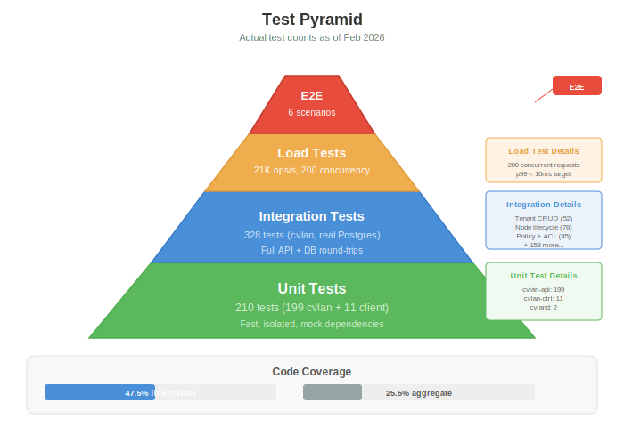
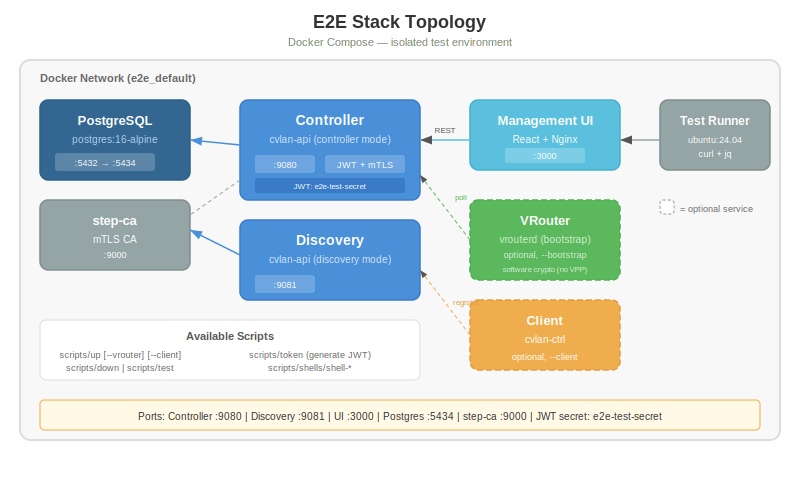
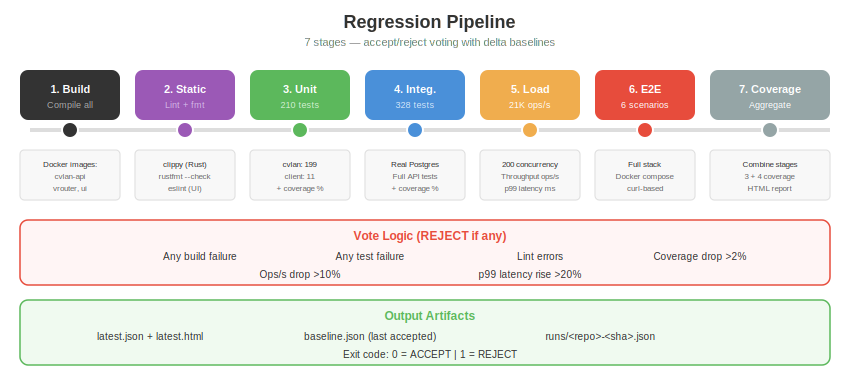

# Testing

## Test Pyramid



| Level | Count | Speed | What It Tests |
|-------|-------|-------|---------------|
| **Unit** | 210 | Fast (~5s) | Individual functions, isolated logic |
| **Integration** | 328 | Medium (~30s) | Full API + real PostgreSQL |
| **Load** | 1 suite | Slow (~2min) | 21K ops/s at 200 concurrency |
| **E2E** | 6 scenarios | Slow (~5min) | Full Docker Compose stack |

## Unit Tests

210 tests across all repos:

| Repo | Tests | What's Tested |
|------|-------|---------------|
| cvlan-api | 199 | IP allocation, auth, validation, serialization |
| cvlan-ctrl | 11 | Config loading, state DB CRUD, env var fallbacks |
| cvland | 2 | Config parsing |

```bash
# Run unit tests
cd ~/ws/cvlan && ./scripts/test --unit
cd ~/ws/client && make test
```

## Integration Tests

328 tests against a real PostgreSQL database:

| Category | Count | Description |
|----------|-------|-------------|
| Tenant CRUD | ~52 | Create, read, update, delete tenants |
| Node lifecycle | ~78 | Registration, IP allocation, status |
| Policy + ACL | ~45 | Group-based allow/deny rules |
| User management | ~40 | Roles, permissions, API keys |
| VRouter | ~35 | Registration, poll, stats |
| IP allocation | ~50 | Watermark, gap reuse, exhaustion |
| Audit logging | ~28 | Event capture, retention, export |

Integration tests use SQLx with a real Postgres instance. All queries are compile-time verified.

```bash
cd ~/ws/cvlan && ./scripts/test        # Full suite (unit + integration)
cd ~/ws/cvlan && ./scripts/test --coverage  # With coverage reporting
```

## Load Tests

Performance testing at scale:

| Metric | Result |
|--------|--------|
| Throughput | 21,000 ops/sec |
| Concurrency | 200 simultaneous connections |
| p99 latency | < 10ms |
| Duration | 60 seconds sustained |

Load tests exercise the IP allocation hot path (the most contention-prone operation).

```bash
cd ~/ws/cvlan && ./scripts/test --load
```

## E2E Tests

Full stack tests using Docker Compose:



6 scenarios covering:
1. Tenant creation and configuration
2. CVLAN creation with CIDR allocation
3. Node registration with token
4. VRouter registration and polling
5. Policy application
6. Audit log verification

```bash
cd ~/ws/e2e && make build-all && make up && make test
```

See [E2E Stack](e2e-stack.md) for topology details.

## Regression Suite



7-stage pipeline with accept/reject voting:

| Stage | What | Hard Fail |
|-------|------|-----------|
| 1. Build | Compile all Docker images | Any build failure |
| 2. Static | Clippy, rustfmt, eslint | Any lint error |
| 3. Unit | Unit tests + coverage | Any test failure |
| 4. Integration | Integration tests + coverage | Any test failure |
| 5. Load | Throughput + latency | ops/s drop >10%, p99 rise >20% |
| 6. E2E | Full stack test | Any scenario failure |
| 7. Coverage | Aggregate coverage report | Coverage drop >2% |

Exit code: `0` = ACCEPT, `1` = REJECT

### Delta-Based Voting

Load and coverage stages compare against a **baseline** (the last accepted run). This catches regressions:
- Performance drop of >10% throughput → REJECT
- Latency increase of >20% p99 → REJECT
- Coverage decrease of >2% → REJECT

### Output Artifacts

```
~/ws/regression_results/
├── latest.json          # Most recent structured results
├── latest.html          # Human-readable report
├── baseline.json        # Last accepted run (for delta comparison)
└── runs/
    └── <repo>-<sha>.json  # Per-commit results
```

## Coverage

| Repo | Line Coverage | Method |
|------|-------------|--------|
| cvlan-api | 47.5% | cargo-llvm-cov |
| Client | — | In progress |
| VRouter | — | In progress |
| **Aggregate** | **25.5%** | Weighted average |

Coverage is tracked in the regression suite baseline and compared on each run.

## Dual-Backend Testing

All integration tests run on both PostgreSQL and SQLite to ensure dual-backend compatibility. SQLite-specific test adaptations:
- UUID as BLOB (not TEXT)
- Timestamps as INTEGER
- `busy_timeout(5000)` for write contention
