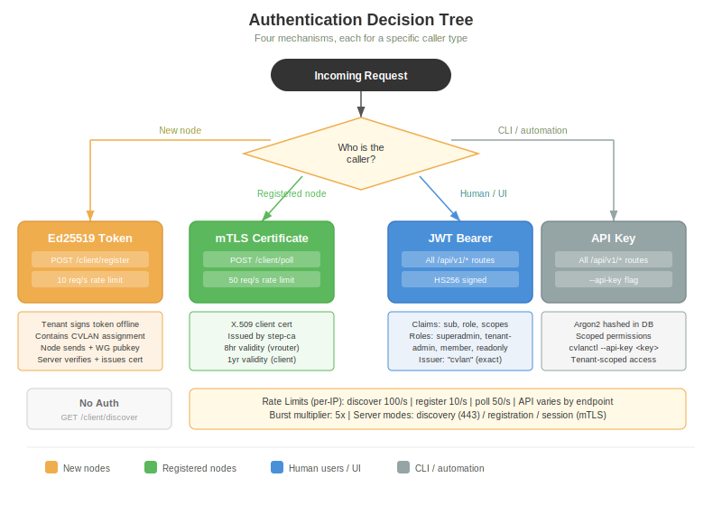
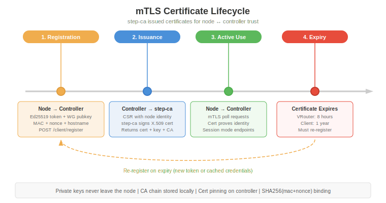
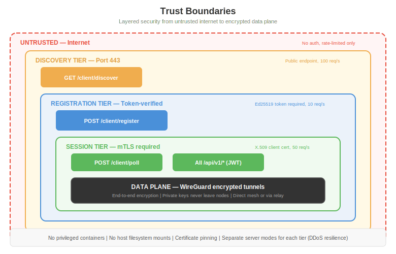

# Authentication & Identity

CloudVLAN uses four distinct authentication mechanisms, each designed for a specific caller type.

## Auth Decision Tree

| Caller | Mechanism | Endpoint |
|--------|-----------|----------|
| New node (unregistered) | Ed25519 registration token | POST /client/register |
| Registered node | mTLS X.509 certificate | POST /client/poll |
| Human user / UI | JWT bearer token | All /api/v1/* |
| CLI / automation | API key | All /api/v1/* |
| Anyone | None (rate-limited) | GET /client/discover |

## 1. JWT Bearer Tokens

Used by the management UI and human users.

**Algorithm**: HS256 (HMAC-SHA256)

**Required claims**:

| Claim | Type | Description |
|-------|------|-------------|
| `sub` | UUID | User ID |
| `iss` | string | Must be exactly `"cvlan"` |
| `role` | string | `superadmin`, `tenantadmin`, `member`, or `readonly` |
| `token_type` | string | `"access"` |
| `scopes` | array | Permission scopes (empty = full access for role) |
| `iat` | number | Issued at (Unix timestamp) |
| `exp` | number | Expiration (Unix timestamp) |

**Role hierarchy**:

| Role | Scope | Can Manage |
|------|-------|------------|
| superadmin | Global | Everything: tenants, regions, relays, all resources |
| tenantadmin | Tenant | Users, groups, CVLANs, nodes, policies, API keys, audit logs |
| member | Tenant | CVLANs, nodes, policies |
| readonly | Tenant | View only (GET requests) |

**JWT secrets** (per environment):

| Environment | Port | Secret |
|-------------|------|--------|
| Dev | 8081 | `development-secret` |
| Test | 8080 | `test-secret-key-for-integration-tests` |
| E2E | 9080 | `e2e-test-secret` |

## 2. API Keys

Used by cvlanctl and automation scripts.

- **Storage**: Argon2-hashed in the database
- **Scope**: Tenant-scoped with configurable permissions
- **Header**: `X-API-Key: cvlan_key_...`
- **CLI usage**: `cvlanctl --api-key <key> tenants list`

API keys are created via the management API and can be revoked at any time.

## 3. Ed25519 Registration Tokens

Used by new nodes to register with the controller.

**How it works**:
1. Admin generates a registration token (server signs with tenant's Ed25519 private key)
2. Token encodes: `tenant_id`, `cvlan_id`, `created_at`, `expires_at`
3. Node presents the token during `POST /client/register`
4. Server verifies the signature using the tenant's public key stored in the database
5. Server extracts the `cvlan_id` — the node has no choice in which CVLAN it joins

**Key properties**:
- **Server-authoritative**: CVLAN assignment is in the token, not chosen by the node
- **Offline signing**: The private key can be kept offline (air-gapped environments)
- **Time-limited**: Tokens have expiration dates
- **One-time use**: Token is consumed on successful registration

## 4. mTLS Certificates

Used by registered nodes for ongoing communication.

**Issuance**: After successful registration, the controller requests a certificate from step-ca and returns it to the node along with the private key and CA chain.

| Property | Client (cvlan-ctrl) | VRouter (vrouterd) |
|----------|--------------------|--------------------|
| Issuer | step-ca | step-ca |
| Validity | 1 year | 8 hours |
| Key storage | /var/lib/cvland/certs/ | /var/lib/vrouter/certs/ |
| Key permissions | 0o600 | 0o600 |
| Renewal | Re-register on expiry | Re-register every 8 hours |
| Binding | SHA256(mac + nonce) | SHA256(mac + nonce) |

**Security properties**:
- Private keys never leave the node
- CA chain stored locally for verification
- Certificate pinning on the controller connection
- MAC + nonce binding prevents certificate reuse across devices

## Rate Limiting

All authentication endpoints have per-IP rate limits:

| Endpoint | Rate | Burst (5x) |
|----------|------|------------|
| GET /client/discover | 100/s | 500 |
| POST /client/register | 10/s | 50 |
| POST /client/poll | 50/s | 250 |

## Trust Boundaries

The system has four trust tiers, from untrusted to fully encrypted:

1. **Internet** — No auth, rate-limited only (discovery endpoint)
2. **Discovery tier** — Public, rate-limited, returns only the controller URL
3. **Registration tier** — Ed25519 token required, rate-limited
4. **Session tier** — mTLS certificate required, encrypted
5. **Data plane** — End-to-end WireGuard encryption
