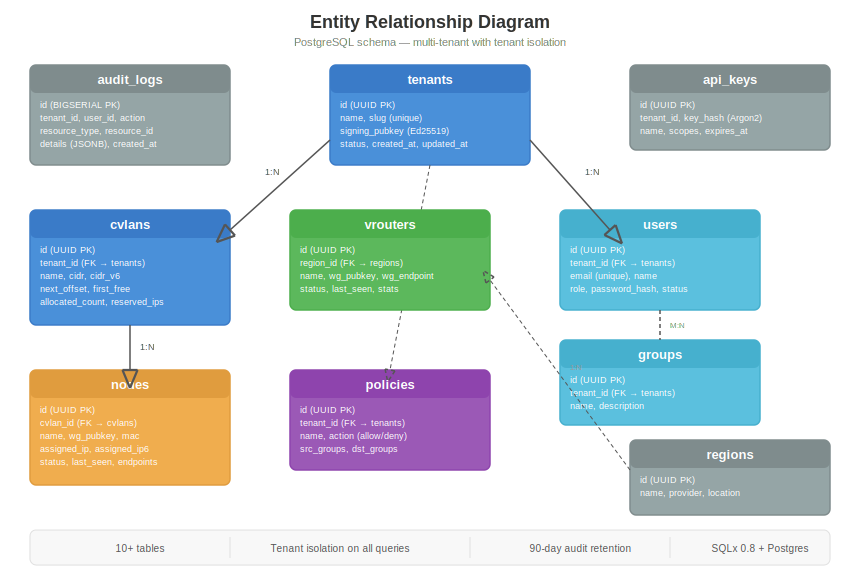

# Database Design

CloudVLAN uses a dual-database architecture: PostgreSQL for the central control plane, and SQLite for local state on data plane nodes.

## PostgreSQL Schema



### Core Tables

| Table | Purpose | Key Fields |
|-------|---------|------------|
| **tenants** | Tenant isolation root | id, name, slug, signing_pubkey, status |
| **cvlans** | Virtual networks | id, tenant_id, name, cidr, next_offset, first_free |
| **nodes** | Registered devices | id, cvlan_id, name, wg_pubkey, assigned_ip, status |
| **users** | Human users | id, tenant_id, email, role, password_hash |
| **groups** | Policy targeting | id, tenant_id, name |
| **group_members** | M:N users↔groups | user_id, group_id |
| **policies** | ACL rules | id, tenant_id, name, action, src_groups, dst_groups |
| **vrouters** | VPP gateways | id, region_id, name, wg_pubkey, status |
| **regions** | Geographic regions | id, name, provider, location |
| **api_keys** | CLI/automation auth | id, tenant_id, key_hash, scopes |
| **audit_logs** | Change tracking | id, tenant_id, user_id, action, resource_type, details |

### Tenant Isolation

Every query is scoped to a tenant. There is no way to accidentally leak data across tenants:

```sql
-- Every query includes tenant_id
SELECT * FROM nodes WHERE tenant_id = $1 AND id = $2;
```

VRouters and regions are **global** (managed by superadmin), not tenant-scoped. A system tenant exists for audit log entries related to global operations.

### IP Allocation State

Each CVLAN maintains its own allocation state:

```sql
-- Per-CVLAN IP allocation
ALTER TABLE cvlans ADD COLUMN next_offset INTEGER DEFAULT 2;
ALTER TABLE cvlans ADD COLUMN first_free INTEGER;
ALTER TABLE cvlans ADD COLUMN allocated_count INTEGER DEFAULT 0;
ALTER TABLE cvlans ADD COLUMN reserved_ips TEXT DEFAULT '[]';
```

See [IP Allocation](ip-allocation.md) for the algorithm details.

### Audit Log Retention

Audit logs have automatic 90-day retention, enforced by the background job scheduler:

```sql
DELETE FROM audit_logs WHERE created_at < NOW() - INTERVAL '90 days';
```

Logs can be exported via API before deletion for compliance archival.

## SQLite State Databases


Data plane nodes (vrouterd and cvlan-ctrl) maintain local SQLite databases for:
- **Identity persistence** — Node ID, assigned IP survive restart
- **Peer cache** — Operates with stale data if controller is unreachable
- **Sync checkpoint** — Resume delta polling without full resync

### vrouterd state.db

```sql
PRAGMA journal_mode=WAL;
PRAGMA synchronous=NORMAL;

CREATE TABLE controller_state (
    key TEXT PRIMARY KEY,
    value BLOB NOT NULL
);
-- Keys: node_id, assigned_ip, wg_pubkey, controller_url, registered_at

CREATE TABLE interfaces (
    name TEXT PRIMARY KEY,
    vpp_sw_if_index INTEGER,
    type TEXT,
    wg_pubkey BLOB,
    endpoint TEXT,
    assigned_ip TEXT
);

CREATE TABLE routes (
    prefix TEXT PRIMARY KEY,
    next_hop TEXT,
    vrf INTEGER,
    interface TEXT
);

CREATE TABLE sync_state (
    key TEXT PRIMARY KEY,
    value TEXT NOT NULL
);
```

### cvlan-ctrl state.db

```sql
PRAGMA journal_mode=WAL;
PRAGMA synchronous=NORMAL;

CREATE TABLE controller_state (
    key TEXT PRIMARY KEY,
    value BLOB NOT NULL
);
-- Keys: node_id, assigned_ip, assigned_ip6, cvlan_id, tenant_id

CREATE TABLE peers (
    node_id BLOB PRIMARY KEY,     -- UUID 16 bytes
    name TEXT,
    wg_pubkey BLOB NOT NULL,      -- 32 bytes (Curve25519)
    assigned_ip TEXT NOT NULL,
    assigned_ip6 TEXT,
    endpoints TEXT,                -- JSON array
    derp_region INTEGER,
    online INTEGER DEFAULT 1,
    updated_at INTEGER NOT NULL
);

CREATE TABLE sync_state (
    key TEXT PRIMARY KEY,
    value TEXT NOT NULL
);
```

Key difference: cvlan-ctrl is simpler — no VRF, no routes, no VPP interface indices. Just peers.

## Dual-Backend Architecture

cvlan-api supports both PostgreSQL and SQLite:

| Feature | PostgreSQL | SQLite |
|---------|-----------|--------|
| Use case | Multi-node, SaaS | Single-box self-hosted |
| Driver | SQLx 0.8 (async) | rusqlite (sync, bundled) |
| UUID storage | Native UUID type | 16-byte BLOB |
| Timestamps | TIMESTAMPTZ | INTEGER (Unix epoch) |
| Concurrency | High (MVCC) | Limited (WAL helps) |
| Query verification | Compile-time (SQLx) | Runtime |

### SQLite Adaptations

```sql
-- UUID as BLOB (not TEXT) for compactness
INSERT INTO nodes (id, ...) VALUES (X'0123456789abcdef0123456789abcdef', ...);

-- busy_timeout for write contention
PRAGMA busy_timeout = 5000;
```

All integration tests run on both backends to ensure compatibility.
