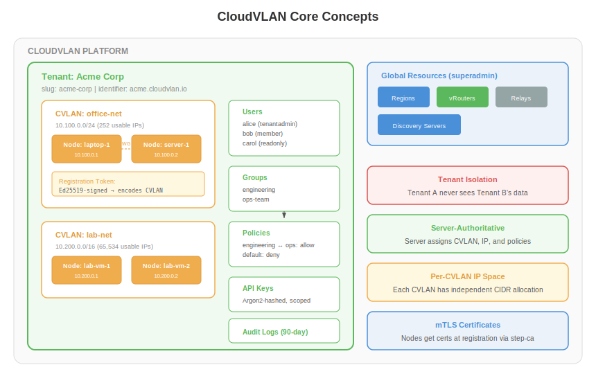
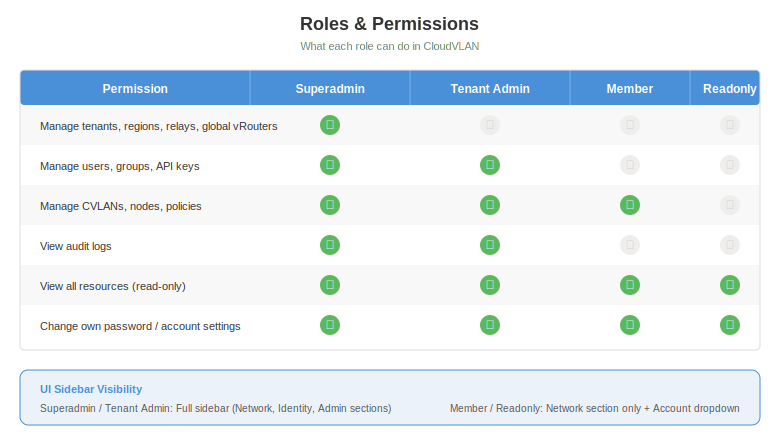
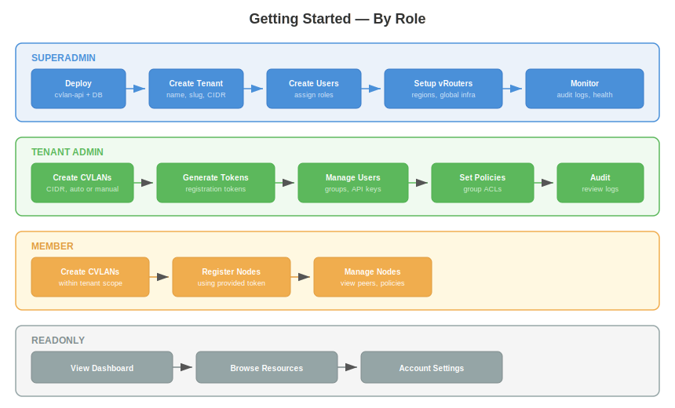
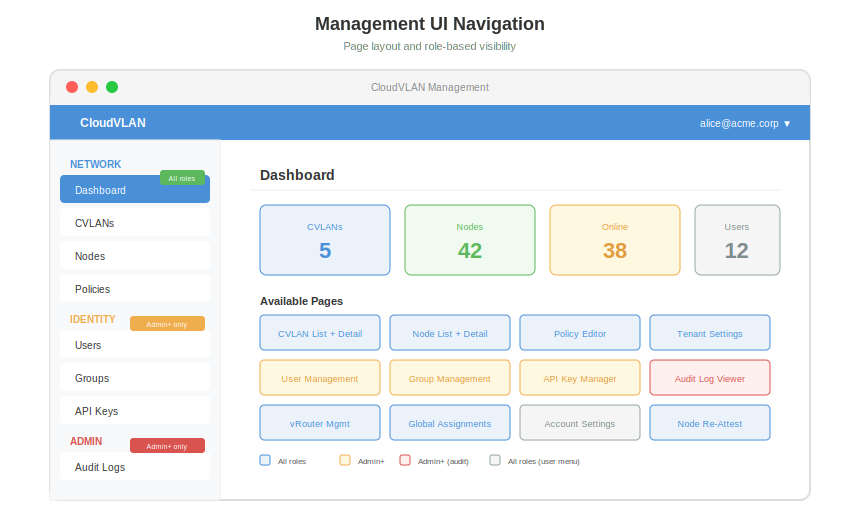
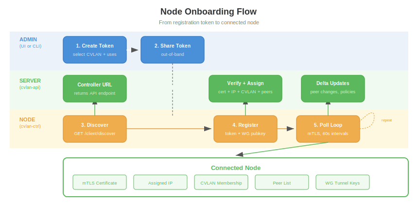

# User Guide

> How to use CloudVLAN — from initial setup to day-to-day operations.

## What is CloudVLAN?

CloudVLAN is an overlay network platform that lets you connect machines across sites, clouds, and offices using encrypted tunnels. Think of it as a private network layer on top of the public internet.


**Key features:**
- **Multi-tenant** — full isolation between organizations
- **Server-authoritative** — the server decides which network a node joins, what IP it gets, and what policies apply
- **Dual protocol** — WireGuard for simplicity, IPsec for compliance
- **Self-hosted or SaaS** — same product, same features
- **Managed gateways (vRouters)** — VPP-based virtual routers for site-to-site connectivity

---

## Core Concepts



### Tenant

The top-level isolation unit. Each tenant has its own networks, users, policies, and audit trail. A tenant is typically an organization or department.

- Has a unique **slug** (e.g., `acme-corp`) and **identifier** (e.g., `acme.cloudvlan.io`)
- Contains all resources: CVLANs, nodes, users, groups, policies, API keys
- Tenant A's resources are invisible to Tenant B

### CVLAN

A virtual network within a tenant. Each CVLAN has its own IP address range (CIDR) and is fully isolated from other CVLANs.

- **CIDR range**: e.g., `10.100.0.0/24` gives you 252 usable addresses
- **Auto-CIDR**: Let the system pick the next available range automatically
- **IP allocation**: Managed by the server — nodes never choose their own IP
- A tenant can have multiple CVLANs (e.g., `office-net`, `lab-net`, `prod-net`)

### Node

A machine connected to a CVLAN. Laptops, servers, VMs, containers — anything that runs the CloudVLAN client.

- Joins a CVLAN via a **registration token** (admin provides it out-of-band)
- Receives an **mTLS certificate** at registration for secure polling
- Gets assigned an **IP address** within the CVLAN's CIDR
- Sees only peers in the same CVLAN

### Registration Token

An Ed25519-signed token that authorizes a node to join a specific CVLAN. The node never specifies which CVLAN it wants — that information is encoded in the token by the admin.

- **Single-use or multi-use** (configurable `max_uses`)
- **Expiry** — tokens have a time-to-live
- **Server-authoritative** — the server verifies the signature and extracts the CVLAN assignment

### Policy

Group-based access control. Policies define which groups of nodes can communicate with each other.

- Policies are defined between **groups** (e.g., "engineering can reach ops-team")
- Default stance is configurable per tenant
- Enforcement is at the data plane level (WireGuard peer filtering)

### Group

A named collection of nodes for policy targeting. Nodes can belong to multiple groups.

### vRouter

A VPP-based virtual router that acts as a gateway between sites or between CVLANs and external networks. Managed by superadmins, assigned to tenants and CVLANs.

---

## Roles and Permissions



CloudVLAN has four roles, each with increasing privileges:

| Role | Scope | Typical User |
|------|-------|--------------|
| **Superadmin** | Global platform management | Platform operator |
| **Tenant Admin** | Full tenant management | IT admin, team lead |
| **Member** | Network operations within tenant | Engineer, developer |
| **Readonly** | View-only access | Auditor, observer |

### What Each Role Can Do

| Action | Superadmin | Tenant Admin | Member | Readonly |
|--------|:----------:|:------------:|:------:|:--------:|
| Manage tenants, regions, relays, global vRouters | Yes | — | — | — |
| Manage users, groups, API keys | Yes | Yes | — | — |
| Manage CVLANs, nodes, policies | Yes | Yes | Yes | — |
| View audit logs | Yes | Yes | — | — |
| View all resources | Yes | Yes | Yes | Yes |
| Change own password | Yes | Yes | Yes | Yes |

### UI Visibility

The management UI shows different sidebar sections depending on your role:
- **Superadmin / Tenant Admin**: Full sidebar — Network, Identity, Admin sections
- **Member / Readonly**: Network section only. Account settings via the user dropdown menu

---

## Getting Started



### For Superadmins: Initial Platform Setup

**1. Deploy cvlan-api**

Deploy the control plane API with a PostgreSQL database (or SQLite for small deployments). See the [Self-Hosted Deployment](../operations/deployment/self-hosted.md) guide for production setup.

The API runs as a single binary with configurable server modes. For a small deployment, combined mode handles everything:

```bash
cvlan-api --mode combined \
  --listen 0.0.0.0:8080 \
  --discovery-listen 0.0.0.0:443 \
  --database-url "postgres://cvlan:secret@db:5432/cvlan"
```

For production, separate the tiers — only discovery is public-facing:

```
discovery.cloudvlan.io:443   → --mode discovery   (public, rate-limited)
register.cloudvlan.io:8080   → --mode registration (semi-public)
session.internal:8080        → --mode session      (mTLS only, internal)
api.cloudvlan.io:8080        → --mode controller   (admin access)
```

**2. Create a Tenant**

Via CLI:
```bash
cvlanctl tenant create --name "Acme Corp" --slug acme-corp
```

Via UI:
- Navigate to the Tenants page
- Click "Create Tenant"
- Enter name, slug, and optional settings (cert validity, no_sharing flag)

**3. Create Users**

```bash
cvlanctl user create -t acme-corp --email alice@acme.corp --role tenantadmin
cvlanctl user create -t acme-corp --email bob@acme.corp --role member
```

**4. Set Up Global Infrastructure** (optional)

- Create **Regions** for geographic grouping
- Create **vRouters** and assign them to tenants/CVLANs
- Configure **Discovery Servers** for distributed entry points

---

### For Tenant Admins: Tenant Configuration

**1. Create CVLANs**

Via CLI:
```bash
# Manual CIDR
cvlanctl cvlan create -t acme-corp --name office-net --cidr 10.100.0.0/24

# Auto-CIDR (system picks next available)
cvlanctl cvlan create -t acme-corp --name lab-net --auto-cidr
```

Via UI:
- Navigate to CVLANs page
- Click "Create CVLAN"
- Choose manual CIDR or auto-allocation

**2. Generate Registration Tokens**

```bash
# Single-use token for one node
cvlanctl token create -t acme-corp --cvlan office-net --max-uses 1

# Bulk token for 50 nodes
cvlanctl token create -t acme-corp --cvlan office-net --max-uses 50 --expires-in 7d
```

The token encodes which CVLAN the node will join. Share it with node operators out-of-band (email, chat, etc.).

**3. Set Up Groups and Policies**

```bash
# Create groups
cvlanctl group create -t acme-corp --name engineering
cvlanctl group create -t acme-corp --name ops-team

# Add nodes to groups (after they register)
cvlanctl group add-member -t acme-corp --group engineering --node laptop-1

# Create policy
cvlanctl policy create -t acme-corp \
  --source engineering --target ops-team --action allow
```

**4. Manage Users and API Keys**

- Create users with appropriate roles via the Users page
- Generate API keys for automation (Settings > API Keys)
- Review audit logs for compliance

---

### For Members: Day-to-Day Operations

**1. Create CVLANs** (within your tenant)

Members can create CVLANs and manage nodes. Use the UI's CVLAN page to create new networks.

**2. Register Nodes**

Once you have a registration token from your admin:

```bash
# Install cvlan-ctrl on the target machine
# (via .deb package or tarball)

# Configure and start
cvlan-ctrl --token <registration-token> --api-url https://api.cloudvlan.io
```

The client will:
1. **Discover** the controller URL
2. **Register** with the token, receiving a certificate + IP + peer list
3. **Poll** for updates every 60 seconds

**3. Monitor Nodes**

Use the Nodes page in the UI to see:
- Node status (online/offline)
- Assigned IP address
- CVLAN membership
- Last poll time
- Certificate expiry

---

### For Readonly Users: Viewing Resources

Readonly users can browse all network resources:
- View CVLANs and their configuration
- View nodes and their status
- View policies and group memberships
- Access account settings to change their own password

---

## Using the Management UI



### Navigation

The UI is organized into sections:

**Network** (all roles)
- **Dashboard** — Overview stats: CVLANs, nodes, online count, users
- **CVLANs** — List and manage virtual networks. Click a CVLAN to see its nodes and settings.
- **Nodes** — List all nodes. Click a node for detail: IP, status, cert expiry, re-attest button.
- **Policies** — Group-based ACL editor

**Identity** (admin+ only)
- **Users** — Create, edit, and manage user accounts
- **Groups** — Create groups and manage membership
- **API Keys** — Generate and revoke programmatic access keys

**Admin** (admin+ only)
- **Audit Logs** — Searchable log of all operations with actor, action, resource, and timestamp
- **vRouter Management** — View and manage VPP gateways
- **Global Assignments** — Assign vRouters to tenants and CVLANs

**Account** (all roles, via user dropdown)
- **Account Settings** — Change password, view profile

### Key Pages

**CVLAN Detail Page**
- Shows CIDR, node count, available IPs
- Lists all nodes in the CVLAN with their IP and status
- "Create Token" button to generate registration tokens

**Node Detail Page**
- Shows assigned IP, CVLAN, status, last poll time
- Displays certificate expiry date (`cert_expires_at`)
- "Re-Attest" button for generating one-time re-authentication codes
- Peer visibility information

**Tenant Settings**
- Configure `cert_validity_hours` for new certificates
- Toggle `no_sharing` flag (prevents assignment to shared/global vRouters)

---

## Using the CLI (cvlanctl)

The admin CLI `cvlanctl` provides full control over the platform from the terminal.

### Connection

```bash
# Connect to your CloudVLAN instance
cvlanctl --api-url https://api.cloudvlan.io --api-key <key> <command>
```

### Common Commands

```bash
# Tenants
cvlanctl tenant list
cvlanctl tenant create --name "Acme Corp" --slug acme-corp
cvlanctl tenant get -t acme-corp

# CVLANs
cvlanctl cvlan list -t acme-corp
cvlanctl cvlan create -t acme-corp --name office-net --cidr 10.100.0.0/24
cvlanctl cvlan delete -t acme-corp <cvlan-id>

# Nodes
cvlanctl node list -t acme-corp
cvlanctl node get -t acme-corp <node-id>
cvlanctl node delete -t acme-corp <node-id>

# Tokens
cvlanctl token create -t acme-corp --cvlan office-net --max-uses 10
cvlanctl token list -t acme-corp

# Audit Logs
cvlanctl audit-log list -t acme-corp --last 24h
cvlanctl audit-log list --action node.create --last 7d

# Users
cvlanctl user create -t acme-corp --email alice@acme.corp --role tenantadmin
cvlanctl user list -t acme-corp
```

### Output Formats

```bash
# Default: human-readable table
cvlanctl tenant list

# JSON output for scripting
cvlanctl tenant list -o json

# Specific tenant (supports slug, short UUID, or full UUID)
cvlanctl cvlan list -t acme-corp
cvlanctl cvlan list -t f0756c0b
cvlanctl cvlan list -t f0756c0b-1234-5678-9abc-def012345678
```

---

## Connecting Nodes



### The Registration Flow

1. **Admin creates a registration token** specifying the target CVLAN and allowed uses
2. **Admin shares the token** out-of-band (email, Slack, etc.) with the node operator
3. **Node operator installs the client** and starts it with the token
4. **Client discovers** the controller URL via the discovery endpoint
5. **Client registers** — sends token + WireGuard public key + MAC address
6. **Server verifies** the token signature, assigns an IP, issues an mTLS certificate
7. **Client enters poll loop** — checks for peer changes and policy updates every 60 seconds

### Client Components

The CloudVLAN client runs as three processes:

| Component | Purpose |
|-----------|---------|
| **cvlan-ctrl** | Control plane daemon — handles discovery, registration, and polling |
| **cvland** | Data plane daemon — manages WireGuard tunnels (future) |
| **cvlancli** | CLI tool for inspecting the running daemon |

### Client Configuration

The client reads its configuration from `/etc/cvlan/cvlan-ctrl.yaml`:

```yaml
api_url: "https://api.cloudvlan.io"
discovery_url: "https://discovery.cloudvlan.io"  # optional
registration_token: "eyJ..."
state_dir: "/var/lib/cvlan"
log_level: "info"
log_format: "text"  # or "json"
poll_interval_secs: 60
```

### Inspecting a Running Client

Use `cvlancli` to query the running daemon via IPC:

```bash
# Check status
cvlancli status

# List discovered peers
cvlancli peers

# Show peer detail
cvlancli peer <peer-id>

# Show current config
cvlancli config

# Force an immediate poll
cvlancli debug force-poll

# Dump internal state
cvlancli debug dump-state
```

---

## Self-Service Re-Attestation

When a node's certificate expires or needs to be refreshed, admins can generate a one-time re-attestation code without needing physical access to the machine.

### How It Works

1. **Admin generates a code** — via UI (node detail page > "Re-Attest" button) or API
2. **Code format**: `XXXX-XXXX` (unambiguous charset — no 0/O/1/I confusion)
3. **Admin sends the code** to the node operator out-of-band
4. **Node operator runs**: `cvlancli reauth --code XXXX-XXXX`
5. **Client exchanges** the code for a fresh mTLS certificate
6. **Code is single-use** — consumed atomically on first use

### Security

- Codes are SHA256-hashed before storage (raw code never stored)
- Single-use: `used_at IS NULL` check prevents replay
- Time-limited: codes expire after a configurable window
- Charset avoids ambiguity: `ABCDEFGHJKLMNPQRSTUVWXYZ23456789`

---

## Troubleshooting

### Node won't register

| Symptom | Likely Cause | Fix |
|---------|-------------|-----|
| 401 Unauthorized | Token expired or already consumed | Generate a new token |
| 404 Not Found | Wrong API URL or CVLAN deleted | Verify `api_url` in config |
| Connection refused | API not reachable | Verify `api_url` and network connectivity |
| Certificate error | Wrong CA chain | Ensure client has correct `ca_chain` |

### Node shows offline

- Check if `cvlan-ctrl` is running: `systemctl status cvlan-ctrl`
- Check logs: `journalctl -u cvlan-ctrl -f`
- Verify network connectivity to the API endpoint
- Check certificate expiry: `cvlancli status`

### UI not loading

1. Check if the API is healthy: `curl https://api.cloudvlan.io/health`
2. Check browser console for CORS or network errors
3. Verify the UI is configured to point at the correct API endpoint

### Audit log queries return nothing

- Audit logs are tenant-scoped — superadmins can query globally, others must specify a tenant
- Logs are retained for 90 days after tenant deletion
- Use `--last 7d` or `--since`/`--until` for time-based filtering

### Certificate expired

Use the self-service re-attestation flow:
1. Admin generates a re-attest code from the node detail page
2. Node operator runs `cvlancli reauth --code XXXX-XXXX`
3. Client receives a fresh certificate and resumes polling
